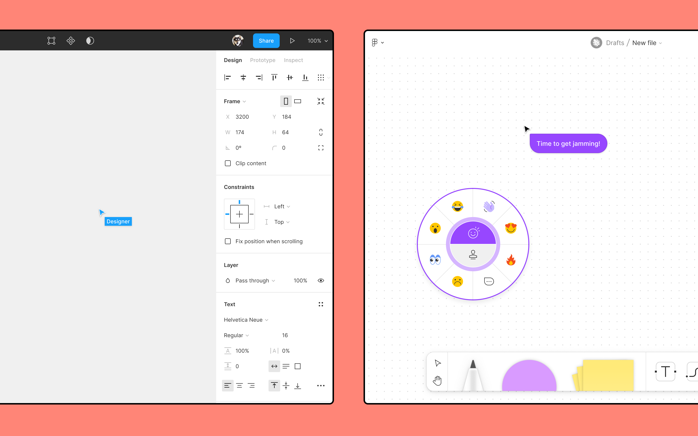
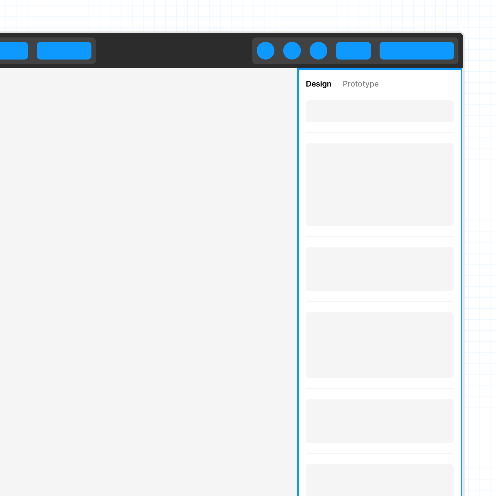
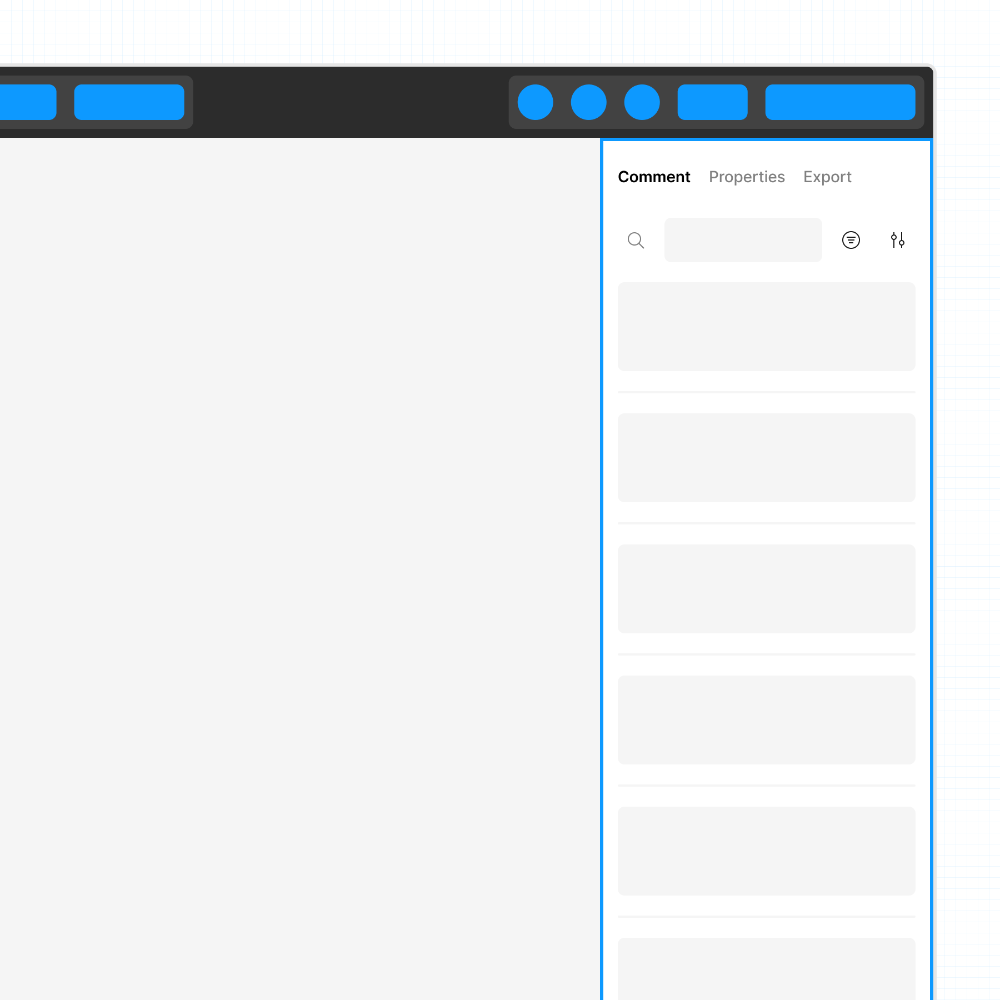
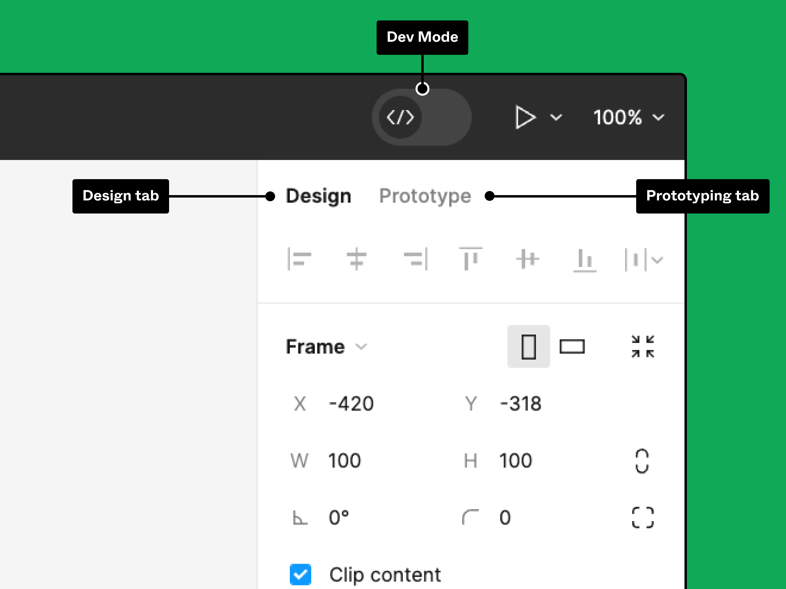
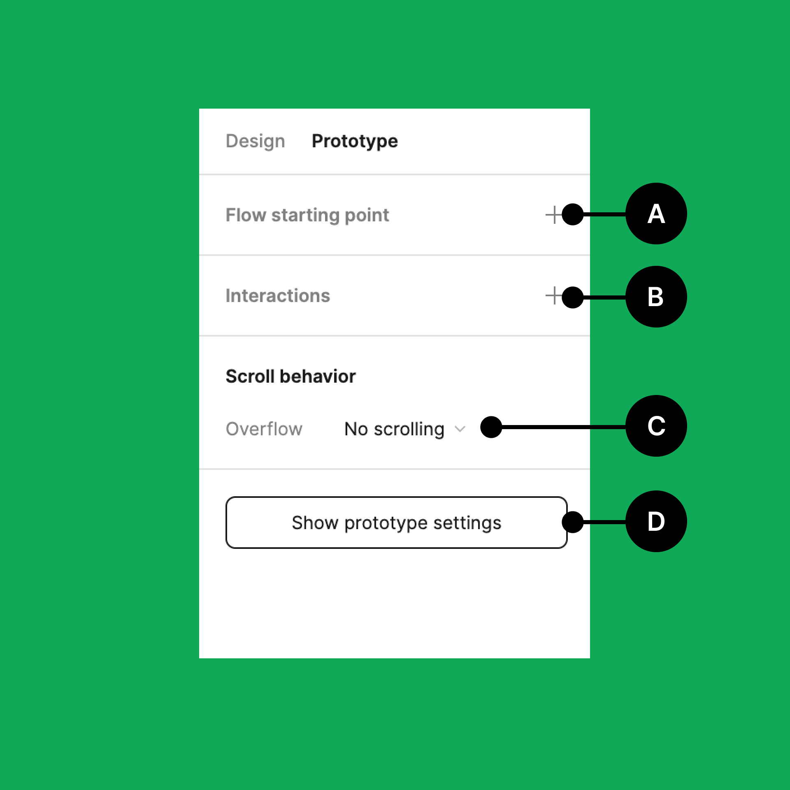
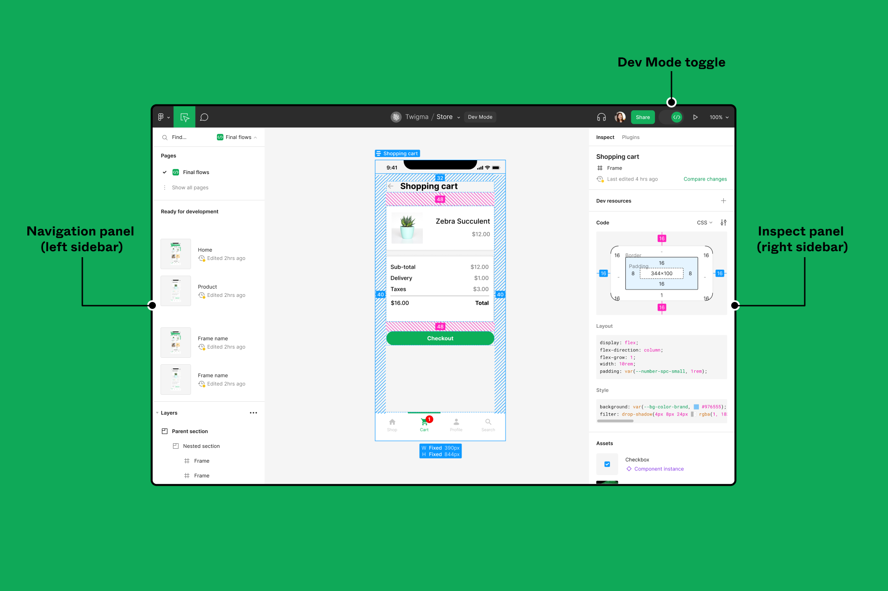
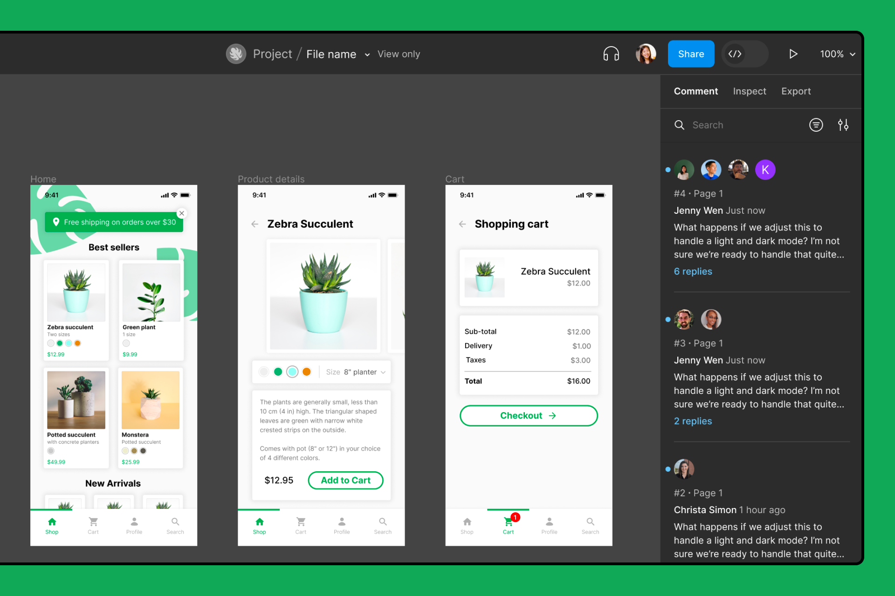
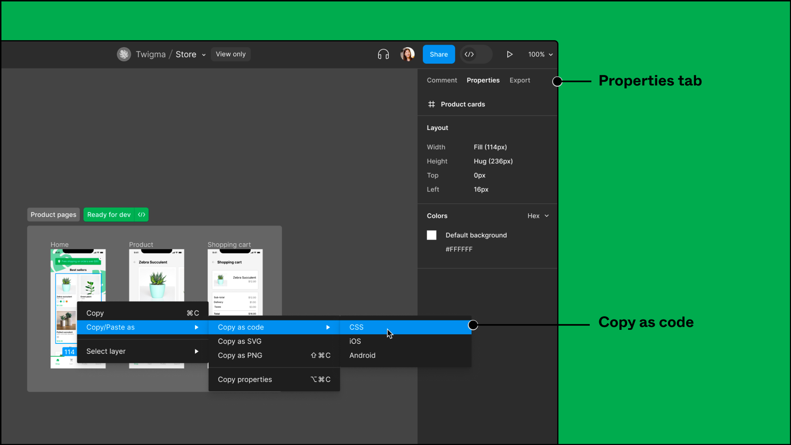
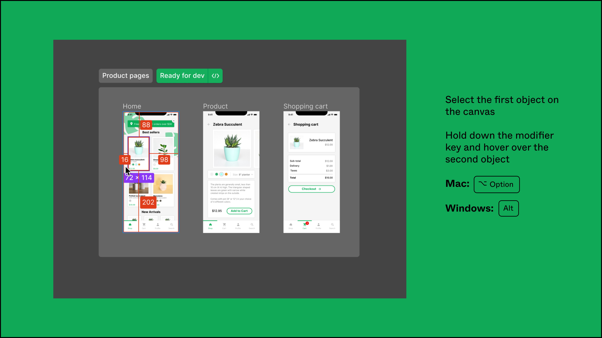
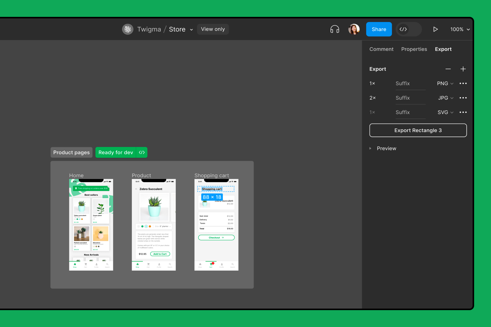

# L'interface de Figma

Figma propose de nombreuses ressources d'apprentissage en ligne, c'est pourquoi nous ne ferrons ici qu'un rapide tour d'horizon de l'interface, pour approfondir vos connaissances du logiciels, n'hésitez pas à parcourir les liens présentés dans ce document. Attention toutefois, Figma n'étant pas encore disponible en français, la plupart de ces ressources sont écrites en anglais.

## Fichiers de design

Figma propose 2 types de fichiers, les fichiers de design et les fichiers Figjam. Les deux produits aident des personnes d'horizons et de rôles différents à exprimer leurs idées visuellement et à créer des choses ensemble.

- **Figma design** permet de créer, de partager et de tester des designs pour des sites web, des applications mobiles et d'autres produits et expériences numériques. C'est un outil populaire pour les concepteurs, les gestionnaires de produits, les rédacteurs et les développeurs et il aide toute personne impliquée dans le processus de conception à contribuer, à donner son avis et à prendre de meilleures décisions, plus rapidement.
- **FigJam** vous permet de créer des tableaux blancs en ligne auxquels tout le monde peut participer. FigJam est souvent utilisé pour des réunions, des brainstormings, des diagrammes, des planifications et des recherches. Dans FigJam, vous pouvez utiliser du texte, des formes, des dessins, des images, des notes autocollantes et d'autres éléments pour représenter visuellement des idées et travailler ensemble.

## Tour de l'interface

Concevez, créez des prototypes et explorez les propriétés des calques dans la barre latérale droite.

Lorsque vous êtes dans Figma design, une barre latérale s'affiche de chaque côté du canevas. Avec la [barre d'outils](https://help.figma.com/article/104-toolbar), ces barres latérales constituent l'interface utilisateur de Figma.

L'interface utilisateur de Figma vous permet d'accéder, de créer et d'ajuster les éléments de votre design.

- La barre latérale gauche vous donne accès à **Layers**, **Assets** et aux pages incluses dans votre fichier. C'est ce que nous appelons le panneau **Layers**.
- La barre latérale droite vous permet d'afficher ou d'ajuster les propriétés du design et les paramètres du prototype de votre design.

Dans cet article, nous allons vous faire découvrir la barre latérale droite.

Les éléments auxquels vous avez accès dans la barre latérale droite dépendent de vos autorisations dans le fichier et de votre [type de place](https://help.figma.com/hc/en-us/articles/360039960434) :

### Accès en lecture seule

- Consulter et rechercher des commentaires
- Inspecter les propriétés des calques et afficher le code de sortie
- Appliquer des paramètres d'exportation

### Accès éditeur

- Ajouter et modifier les propriétés de design des calques
- Ajouter des interactions, des flux et des paramètres de prototypes

### Utiliser la barre latérale droite pour l'accès éditeur

## Design

L'onglet **Design** vous permet de visualiser, d'ajouter, de supprimer ou de modifier les propriétés des objets de votre design.

Si rien n'est sélectionné dans le canevas, vous pourrez effectuer les opérations suivantes à partir de l'onglet **Design** :

- Accéder aux styles et aux variables locales au fichier
- Mettre à jour la couleur d'arrière-plan du canevas
- Exporter la page entière

Si vous sélectionnez un calque, vous pourrez accéder à de nombreux paramètres différents pour le modifier. Les paramètres disponibles dépendent du calque sélectionné.

- [Alignement et distribution](https://help.figma.com/hc/en-us/articles/360039956814)
- [Taille et orientation du cadre](https://help.figma.com/hc/en-us/articles/360041539473)
- [Position](https://help.figma.com/hc/en-us/articles/360039956914) (X et Y)
- [Dimensions et rotations](https://help.figma.com/hc/en-us/articles/360039956914) (largeur et hauteur)
- [Rayon du coin](https://help.figma.com/hc/en-us/articles/360050986854-Adjust-corner-radius-and-smoothing)
- [Contraintes](https://help.figma.com/hc/en-us/articles/360039957734)
- [Grille de disposition](https://help.figma.com/hc/en-us/articles/360040450513)
- [Propriétés du composant](https://help.figma.com/hc/en-us/articles/5579474826519-Explore-component-properties)
- [Instance](https://help.figma.com/hc/en-us/articles/360039150413)
- [Disposition automatique](https://help.figma.com/hc/en-us/articles/360040451373-Explore-auto-layout-properties)
- Calque ([Modes de fusion](https://help.figma.com/hc/en-us/articles/360040667874))
- [Texte](https://help.figma.com/hc/en-us/articles/360039956634)
- [Remplissage](https://help.figma.com/hc/en-us/articles/360040623954)
- [Contour](https://help.figma.com/hc/en-us/articles/360041003694)
- [Effets](https://help.figma.com/hc/en-us/articles/360041488473)
- [Paramètres d'exportation](https://help.figma.com/hc/en-us/articles/360040028114)

### Prototype

Utilisez l'onglet **Prototype** pour commencer à construire des prototypes.

Sélectionnez n'importe quel objet pour commencer. Ensuite, dans l'onglet **Prototype** :

1.  Ajoutez un [point de départ de flux](https://help.figma.com/hc/en-us/articles/360039823894#Starting_point)  
    Un flux est un chemin que les utilisateurs empruntent à travers le réseau de cadres connectés qui composent votre prototype. Ajoutez un point de départ pour choisir le premier cadre du parcours.
2.  Ajoutez une [interaction](https://help.figma.com/hc/en-us/articles/360040315773-Create-connections-and-flows#Create_an_interaction)  
    Ouvrez la fenêtre modale **Interaction Details**, dans laquelle vous pouvez définir le déclencheur, l'action et les éventuelles animations de l'interaction.
3.  Définissez le [le comportement de défilement](https://help.figma.com/hc/en-us/articles/360039818734-Prototype-scroll-and-overflow-behavior)  
    Sélectionnez la manière dont le prototype réagit au défilement.
4.  Affichez les [paramètres du prototype](https://help.figma.com/hc/en-us/articles/360039823894-Set-prototype-device-and-starting-point#Prototype_settings)  
    Permet de régler l'appareil et l'arrière-plan de votre prototype.

> **Astuce :** Vous pouvez également ajouter des interactions directement sur le canevas en sélectionnant l'onglet **Prototype**, puis en cliquant et en faisant glisser les connexions entre les objets.

**[En savoir plus sur le prototypage dans Figma →](https://help.figma.com/hc/en-us/articles/360040314193)**

### Inspection

[Dev Mode](https://help.figma.com/hc/en-us/articles/15023124644247) est un espace de Figma créé spécialement pour les développeurs. Le Dev Mode présente les spécifications de design et les informations pertinentes nécessaires à la compréhension d'un design et à sa transformation en code.

Le Dev Mode vous permet :

- de voir et de copier des propriétés, des valeurs et des codes à partir de composants de design ;
- de repérer ce qui a changé depuis la dernière fois que vous avez consulté un fichier, en comparant des versions de cadre ;
- d'examiner des fichiers de design et de les parcourir grâce à de simples interactions qui permettent d'extraire des informations de calque importantes ;
- de trouver rapidement des designs prêts pour le développement grâce aux statuts des sections ;
- de simplifier votre flux de travail grâce à des intégrations axées sur les développeurs, telles que Jira, Storybook et GitHub ;
- d'ajouter des liens pertinents et des ressources de développeurs aux composants.

On accède au Dev Mode à l'aide d'un bouton d'activation situé dans la barre d'outils. Une fois en Dev Mode, l'interface, y compris la barre latérale droite, affiche des fonctions destinées aux développeurs.

[Apprendre à utiliser le Dev Mode ->](https://help.figma.com/hc/en-us/articles/15023124644247)

### Utiliser la barre latérale droite avec un accès en lecture seule

Les spectateurs et les utilisateurs restreints au mode spectateur peuvent collaborer sur les designs, visualiser leurs propriétés, copier le code de base et exporter des ressources.

L'accès spectateur est idéal pour les personnes qui n'ont pas besoin de modifier des designs ou pour les développeurs qui ont besoin d'accéder à des designs, mais qui n'ont pas besoin de l'ensemble des fonctionnalités du Dev Mode.

### Commentaire

Sélectionnez Comment dans la barre latérale droite pour ajouter de nouveaux commentaires ou consulter les commentaires existants. Vous pouvez utiliser les commentaires pour ajouter ou répondre aux remarques, collaborer et réviser plus rapidement—le tout à partir du fichier de design d'origine.

L'onglet **Comment** permet d'afficher tous les commentaires existants dans un fichier. Vous pouvez également rechercher un commentaire particulier ou un ensemble de commentaires dans un fichier :

- Saisissez un mot-clé dans le champ de recherche pour trouver un commentaire particulier.
- Utilisez le filtre pour afficher les commentaires en fonction de leur date de publication ou pour ne voir que ceux que vous n'avez pas encore lus. Ici, vous pouvez filtrer pour n'afficher qu'un certain nombre de commentaires.

Cliquez sur les paramètres pour masquer les icônes ou gérer vos notifications de commentaires dans un fichier.

> Découvrez comment [ajouter des commentaires à un fichier Figma design →](https://help.figma.com/hc/en-us/articles/360041068574) ou comment [afficher et gérer les commentaires →](https://help.figma.com/hc/en-us/articles/360041547593-View-and-manage-comments)

### Propriétés

L'onglet **Properties** de la barre latérale droite vous permet d'inspecter des calques particuliers sur le canevas.

Pour commencer, sélectionnez un calque sur le canevas. Pour ce faire, vous pouvez soit sélectionner l'élément sur le canevas lui-même, soit le sélectionner dans le panneau **Layers** de la barre latérale gauche. Vous pouvez sélectionner n'importe quel type de calque, tel qu'une forme, un texte, un groupe ou un cadre.

Sous Properties, vous trouverez le nom du calque sélectionné et des détails sur celui-ci, tels que sa disposition et ses couleurs.

Cliquez avec le bouton droit de la souris sur le calque dans le canevas pour :

- copier le calque ;
- copier/coller en tant que code (CSS, iOS ou Android), SVG, PNG, copier le lien ou copier ses propriétés ;
- sélectionner un autre calque à l'intérieur du calque sélectionné.

Vous souhaitez mesurer les distances entre les objets ? Vous pouvez utiliser des raccourcis clavier pour accéder rapidement aux informations relatives à l'espacement et au remplissage.  

[Découvrez comment ajouter des directives de mesure →](https://help.figma.com/hc/en-us/articles/360039956974-Measure-distances-between-layers)

### Exporter

Avec un accès en lecture seule, vous pouvez exporter des designs de Figma dans un large éventail de formats de fichiers et d'échelles. L'exportation vous permet de partager du contenu avec d'autres personnes, de déplacer du contenu entre les outils et d'enregistrer des copies de vos designs en dehors de Figma.

[Apprendre à exporter du contenu à partir de Figma →](https://help.figma.com/hc/en-us/articles/360040028114-Export-from-Figma)