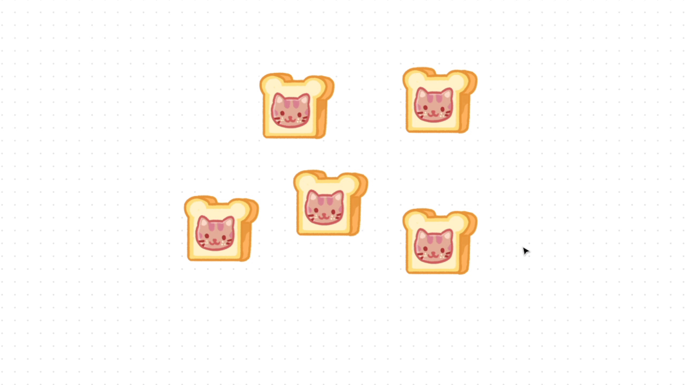
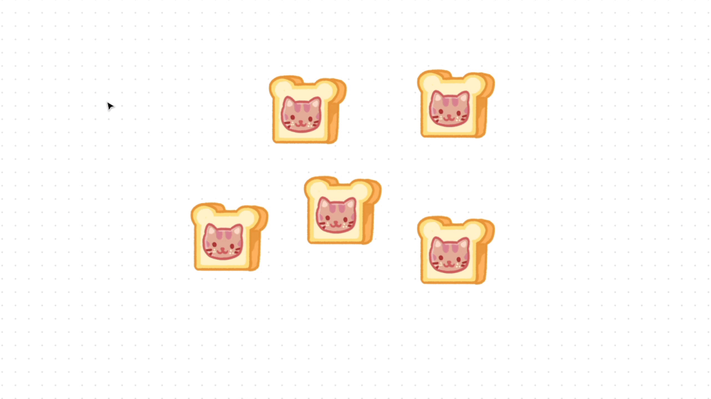

# Sélectionner, déplacer et ordonner des objets

## Outil Déplacer

Lorsque vous créez ou saisissez un fichier FigJam, l'outil **déplacer** est sélectionné par défaut. Utilisez l'outil déplacer pour sélectionner, déplacer et [redimensionner des objets](https://help.figma.com/hc/en-us/articles/1500006206242) sur votre tableau.

Sélectionnez l'outil **déplacer** dans la barre d'outils ou appuyez sur V.

- Sélectionner un seul objet.
- Cliquez sur un espace vide et maintenez-le enfoncé, puis faites glisser votre curseur pour sélectionner plusieurs objets.
- Cliquez sur un objet et maintenez-le enfoncé, puis faites glisser votre curseur pour le déplacer.

## Sélectionner

Sélectionnez les objets pour interagir avec eux et modifiez leurs propriétés. Les objets sélectionnés sont entourés d'une boîte englobante. Dans FigJam, les composants et les autocollants des bibliothèques possèdent une boîte englobante violette, tandis que tous les autres objets ont une boîte englobante bleue.

Vous pouvez désélectionner un objet une fois que vous avez fini d'interagir avec lui.

### Sélectionner un seul objet

1. Sélectionnez l'outil **déplacer** dans la barre d'outils ou appuyez sur V.
2. Cliquez sur un objet pour le sélectionner.

### Sélectionner plusieurs objets

Vous pouvez sélectionner plusieurs objets à la fois. C'est très pratique lorsque vous voulez effectuer la même action sur plusieurs objets pour gagner du temps, comme mettre en bleu plusieurs formes et autocollants.

Cette fonction est utile lorsque vous souhaitez :

- grouper une sélection d'objets,
- déplacer un groupe d'objets sélectionnés,
- mettre à jour une propriété, telle que la couleur, sur plusieurs objets,
- aligner, distribuer l'espacement et réorganiser les objets,
- redimensionner les objets en lot,
- verrouiller/déverrouiller plusieurs objets.

Il existe plusieurs façons de sélectionner plusieurs objets :

#### Touche Maj

1. Sélectionnez un objet sur le tableau.
2. Maintenez la touche Maj enfoncée et cliquez sur un autre objet.
3. Répétez l'opération pour chaque objet à sélectionner.

>**Astuce ! :** Cliquez sur un objet tout en maintenant la touche Maj enfoncée pour le supprimer de la sélection en cours.

#### Cliquer-glisser

Cliquez sur le curseur et faites-le glisser pour créer une sélection en forme de boîte et sélectionnez tous les objets dans une zone spécifique du tableau. Tout objet touché par la boîte sera sélectionné.

1. Cliquez sur une partie vide du tableau et maintenez-la enfoncée.
2. Faites glisser le curseur sur les objets que vous souhaitez sélectionner.
3. Un cadre bleu apparaît autour de chaque objet de la sélection.

Pour supprimer un objet de la sélection, maintenez la touche Maj enfoncée et cliquez sur l'objet.

Remarque

Le fait de cliquer et de faire glisser ne sélectionne pas les objets verrouillés.

### Sélectionner tout

Si vous voulez sélectionner tout sur votre tableau, utilisez les raccourcis clavier suivants pour sélectionner tout.

- Mac : Commande ⌘ A
- Windows : Ctrl A

### Désélectionner des objets

Pour effacer entièrement votre sélection :

- Utilisez la touche Échap
- Cliquez sur un espace vide du tableau

Pour désélectionner un objet d'une sélection de plusieurs objets, maintenez la touche Maj enfoncée et cliquez de nouveau sur l'objet.

## Groupe

Les groupes vous permettent de combiner des objets afin qu'ils puissent être traités comme un seul objet. Pour sélectionner un groupe, cliquez sur l'un des objets groupés.

## Aligner, ranger et organiser vos objets

Lorsque vous créez un diagramme avec des formes et des connecteurs, et laissez des tampons en forme de flammes sur la super idée que votre chef de projet a écrite sur une note, vous créez des objets sur le tableau de FigJam. Chaque objet ayant un emplacement sur le tableau, vous pouvez les aligner et les distribuer pour une meilleure organisation.

### Aligner des objets

Les outils d'alignement vous permettent d'organiser les calques sur le tableau les uns par rapport aux autres. Figma détermine l'alignement de votre calque en fonction de votre sélection.

Les objets de FigJam ne peuvent être alignés que sur d'autres objets. Il existe six options d'alignement différentes :

- Aligner à gauche
- Aligner centres horizontaux
- Aligner à droite
- Aligner en haut
- Aligner centres verticaux

## Mise en ordre

Utilisez l'option Mise en ordre pour réorganiser et organiser des objets tels que des notes et des formes à l'intérieur d'une grille uniforme de lignes et de colonnes. Vous pouvez également ajuster l'espacement horizontal et vertical entre les objets et les réordonner tout en conservant leur espacement.

1. Sélectionnez au moins trois objets sur votre tableau.
2. Cliquez sur dans la barre d'outils de sélection.

Vos objets sont déplacés dans une formation de grille avec un espacement régulier. Les points et les lignes qui apparaissent dans la boîte englobante de sélection vous permettent de réorganiser les objets et d'ajuster l'espacement.

## Ajuster l'espacement

Si une sélection d'objets a été mise en ordre ou possède un espacement réparti uniformément, des lignes roses apparaissent dans la boîte englobante de sélection. Cliquez sur les lignes et faites-les glisser pour augmenter ou diminuer l'espacement entre les objets sur un plan horizontal ou vertical.

Réorganiser les objets dans une grille
--------------------------------------

Si une sélection d'objets a été mise en ordre ou possède un espacement réparti uniformément, des points apparaissent dans la boîte englobante de sélection. Cliquez sur un cercle rose et maintenez-le enfoncé, puis faites glisser votre curseur pour déplacer l'objet vers une autre position dans votre sélection.

### Réorganiser plusieurs objets

1. Maintenez la touche Maj enfoncée.
2. Cliquez sur les cercles roses pour chaque objet que vous souhaitez déplacer.
3. Cliquez sur le cercle rose et maintenez-le enfoncé pour un objet sélectionné, puis faites glisser votre curseur pour le déplacer.

### Permuter les positions de deux objets

1. Cliquez sur le cercle rose d'un objet sélectionné et maintenez-le enfoncé.
2. Maintenez la touche de modification enfoncée :
    - Mac : Commande ⌘
    - Windows : Ctrl
3. Faites glisser votre curseur sur la position d'un autre objet pour permuter les positions de deux objets.

### Modifier l'ordre des objets

Parfois, un objet de votre tableau s'empile sur les autres, les rendant difficiles à voir. Ou bien un objet peut être caché derrière les autres. Modifiez l'ordre d'empilement de votre objet pour le déplacer vers l'avant ou vers l'arrière de votre tableau.

Cliquez avec le bouton droit de la souris sur un objet et sélectionnez l'une des quatre options du menu :

- **Avancer** : déplacer l'objet d'une place vers l'avant dans l'ordre d'empilement.
- **Amener au premier plan** : déplacer l'objet au premier plan de la pile, sur tous les autres objets.
- **Reculer** : déplacer l'objet d'une place vers l'arrière dans l'ordre d'empilement.
- **Repousser au dernier plan** : déplacer l'objet au dernier plan de la pile, sous tous les autres objets.

### Raccourcis clavier

Avancer :

- Mac : `Commande ⌘ ]`
- Windows : `Ctrl ]`

Amener au premier plan :

- Mac : `Commande ⌘ ⌥ Option ]`
- Windows : `Ctrl Shift ]`

Reculer :

- Mac : `Commande ⌘ [`
- Windows : `Ctrl [`

Repousser au dernier plan :

- Mac : `Commande ⌘ ⌥ Option [`
- Windows : `Ctrl Maj [`