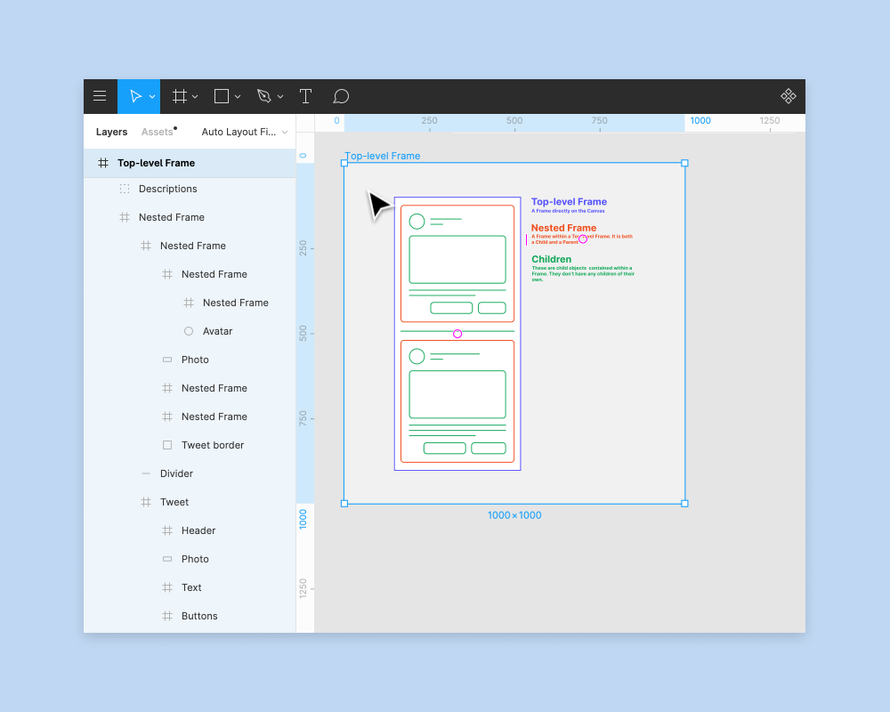

# Frames (Cadres) dans Figma

Dans Figma, vous pouvez ajouter des calques directement dans le Canevas. Si vous réalisez un design pour un périphérique ou une taille d'écran spécifique, vous pouvez créer un conteneur pour vos designs. C'est ici que les **cadres** vont entrer en jeu.

Si vous avez déjà utilisé des outils de design, vous avez l'habitude des plans de travail. Tout comme eux, les cadres vous permettent de choisir une zone du canevas dans laquelle vous pouvez créer vos designs.

Contrairement aux plans de travail traditionnels, vous avez la possibilité d'imbriquer des cadres dans d'autres cadres, permettant ainsi de créer des conceptions plus complexes qui fonctionnent ensemble.

Les cadres vous permettent également d'accéder à des fonctionnalités supplémentaires, telles que [Grilles de mise en page](https://help.figma.com/hc/en-us/articles/360040450513), [Disposition automatique](https://help.figma.com/hc/en-us/articles/360040451373), [Contraintes](https://help.figma.com/hc/en-us/articles/360039957734), et [Réalisation de prototypes](https://help.figma.com/hc/en-us/articles/360040314193).

## Créer des cadres

Créez des cadres dans le canevas à l'aide de l'outil cadre. Il existe plusieurs façons de sélectionner l'outil cadre :

- Utilisez les raccourcis clavier F ou A
- Sélectionnez l' **outil cadre** dans la barre d'outils :

Vous pouvez ensuite créer différentes tailles de cadre dans le canevas :

- Cliquez sur le canevas pour créer un cadre par défaut avec les dimensions de 100 x 100.
- Cliquez sur le canevas et faites-le glisser pour créer un cadre aux dimensions personnalisées.
- Utilisez la liste déroulante de la barre latérale droite pour sélectionner un préréglage de cadre.
    1. Choisissez des préréglages pour les modèles de périphériques et de ressources les plus courants :
        - téléphone,
        - tablette,
        - bureau,
        - montre,
        - papier,
        - médias sociaux,
        - Communauté Figma.
    2. Cliquez sur la flèche pour développer la section et sélectionnez un préréglage dans la liste.

Identifiez les cadres par le symbole dans le Panneau des calques.

> **Astuce !**  Vous pouvez également créer un cadre autour d'objets existants, qu'il s'agisse d'un seul calque ou d'une sélection de calques. Utilisez le raccourci clavier de sélection de cadre :

- **MacOS** : `⌥ Option Commande ⌘ G`
- **Windows** : `Ctrl + Alt + G`

## Propriétés du cadre

Quelques propriétés sont associées aux cadres. Les cadres prennent en charge les propriétés suivantes.

- **Rayon d'Angle** : arrondir le coin d'un cadre pour créer des bords plus doux.
- **Couper le contenu** : masquer tous les objets dans le cadre qui s'étendent au-delà des limites du cadre.
- **Grilles de mise en page** : créer des lignes directrices pour vous aider à structurer vos designs.
- **Disposition automatique :**  Créer des Cadres dynamiques qui répondent à leur contenu.
- **Remplir** : appliquer un remplissage uni, un gradient, des Images (PNG, JPEG, GIF, TIFF et WEBP) à un cadre.
- **Contour** : ajouter des contours à un cadre pour créer une bordure ou une ébauche.
- **Effets** : ajouter une ombre ou des flous à un Cadre.

## Fonctionnalités supplémentaires

Les cadres vous permettent d'accéder à des fonctionnalités supplémentaires dans Figma. Vous devez utiliser les Cadres pour accéder aux fonctions suivantes :

- **[Grilles de mise en page](https://help.figma.com/hc/en-us/articles/360040450513)** : appliquer des grilles, des colonnes et/ou des lignes transparentes aux Cadres pour fournir une structure visuelle.
- [**Contraintes**](https://help.figma.com/hc/en-us/articles/360039957734) : Définissez la façon dont les objets enfants réagissent lorsque vous redimensionnez un Cadre. Appliquez des Contraintes aux  **objets**  dans un Cadre.
- **[Disposition automatique](https://help.figma.com/hc/en-us/articles/360040451373)** : ajouter la disposition automatique aux Cadres pour créer des dispositions dynamiques qui répondent à leur contenu.
- [**Réaliser des prototypes**](https://help.figma.com/hc/en-us/articles/360040314193) : créer des prototypes interactifs qui se déplacent entre les Cadres de votre Canevas.

Un Cadre est un objet  **parent** . C'est-à-dire qu'il peut contrôler ou influencer n'importe quel objet **enfant**  que vous y placez.

## Ajuster les propriétés du cadre

Auparavant, il était possible d'ajuster les propriétés des objets enfants lorsque vous aviez sélectionné le Cadre. Vous pouvez désormais ajuster les propriétés du cadre lui-même.

- Sélectionnez un objet enfant à l'aide du raccourci clavier : Entrée ou Retour.
- Appuyez sur la touche `Tab` pour sélectionner le frère/la sœur suivant(e).
- Appuyez sur `Maj + Tab` pour sélectionner le frère/la sœur précédent(e).
- Appuyez sur `Maj + Entrée` pour sélectionner le parent.

## Imbriquer des cadres dans d'autres cadres

Dans Figma, vous pouvez créer des cadres à l'intérieur d'autres cadres. Ce processus se nomme imbrication. Il vous permet de combiner des cadres avec différentes propriétés afin de construire des interfaces complexes,

créant de nouvelles hiérarchies ou relations :

- **Cadres de premier niveau :** tout cadre qui se trouve directement sur le canevas. Pour qu'un cadre soit un cadre de premier niveau, vous ne pouvez pas l'imbriquer dans un autre cadre, groupe ou objet.
- **Cadre imbriqué** : tout cadre placé dans un autre cadre. Vous pouvez placer des cadres à l'intérieur de cadres de premier niveau ou dans d'autres cadres imbriqués. Les cadres imbriqués sont à la fois parents et enfants.
- **Enfant :** tout objet qui se trouve dans un cadre.

### Cadres de premier niveau

Figma **met en gras** les cadres de premier niveau dans le Panneau des calques et affiche le nom des cadres de premier niveau sur le canevas :

### Cadres imbriqués

Les cadres imbriqués sont des cadres que vous placez dans un autre cadre ou objet, en les faisant devenir un parent et un enfant. Vous pouvez placer des cadres dans :

- Cadres de premier niveau
- d'autres cadres imbriqués,
- des groupes.

Dans notre exemple ci-dessous, chacun de nos éléments se trouve dans son propre cadre. Il y a une barre d'état en haut et un menu de navigation en bas. Nous voyons également une carte qui inclut les informations de nos prochains billets.

En utilisant l'un de nos préréglages d'appareil, il est possible de créer un cadre de premier niveau pour nos éléments. Nous pouvons ajouter nos éléments au cadre de premier niveau afin de créer un seul écran dans notre application mobile.

## Redimensionner les cadres

Vous pouvez interagir avec les cadres comme n'importe quel autre objet du canevas, y compris modifier la taille ou l'échelle des cadres. Il existe plusieurs façons de modifier la taille d'un Cadre :

### Faire glisser le cadre

Faites glisser pour redimensionner un cadre manuellement.

1. Sélectionnez le cadre dans le canevas ou le Panneau des calques dans la barre latérale gauche.
2. Cliquez sur la poignée sur l'un des coins et faites glisser pour redimensionner. Ou cliquez sur l'un des bords et faites-le glisser.

**Astuce !** Pour ignorer les Contraintes sur des objets enfants, maintenez la touche de modification enfoncée :

- macOS : `Commande ⌘`
- Windows : `Ctrl`

### Modifier le préréglage du cadre

Sélectionnez un autre préréglage de cadre pour modifier la taille du cadre.

1. Sélectionnez le cadre.
2. Dans le Panneau Propriétés de la barre latérale droite, sélectionnez le champ cadre.
3. Sélectionnez un préréglage dans la liste.
4. Choisissez des préréglages pour les modèles de périphériques et de ressources les plus courants :
    - téléphone,
    - tablette,
    - bureau,
    - montre,
    - papier,
    - médias sociaux,
    - Communauté Figma.
5. Figma met à jour les dimensions de votre cadre pour qu'elles correspondent au préréglage.

**Remarque :** Si vous avez appliqué des [Contraintes](https://help.figma.com/hc/en-us/articles/360039957734) à n'importe quel objet enfant, Figma les redimensionnera pour les faire correspondre au nouveau préréglage de cadre. Dans le cas contraire, les objets à l'intérieur du cadre resteront aux dimensions et dans la position d'origine.

### Panneau Propriétés

Mettez à jour la **Largeur** et la **Hauteur** du Cadre à l'aide du Panneau Propriétés de la barre latérale de droite.

Saisissez un nouveau numéro dans les champs **W** et **H** ou passez le curseur sur l'icône pour effacer le champ. Faites glisser vers la gauche pour diminuer et vers la droite pour augmenter.

Activez le bouton de lien situé à côté de la **L**argeur et de la **H**auteur pour redimensionner la contrainte aux proportions actuelles.

**Astuce !** Vous pouvez utiliser les champs dimensions pour effectuer des calculs. Cela vous permet de mettre à l'échelle ou de redimensionner rapidement des objets.

- `%` Pourcentage, `ex. 50`
- `+` Addition, `ex. +100`
- `-`  Soustraction, `ex. -20`
- `*`  Multiplication, `ex. \*4`
- `/`  Division, `ex. /8`

Il n'est pas possible de  **multiplier**  une largeur ou une hauteur par un **pourcentage** </span, par exemple `*50 %` donnera une valeur de `50 x la valeur`, et non `50 % de la valeur`.

### Ajuster la taille au contenu

Vous pouvez redimensionner un Cadre pour qu'il rétrécisse ou grossisse pour s'ajuster à ses objets enfants. Cette opération va redessiner le Cadre autour des limites extérieures des objets qui y sont contenus.

- Utilisez le raccourci clavier :
  - macOS: ⌥ Option Maj Commande ⌘ R
  - Windows : Alt Shift Control R
- Cliquez sur dans le coin supérieur droit du Panneau Propriétés

