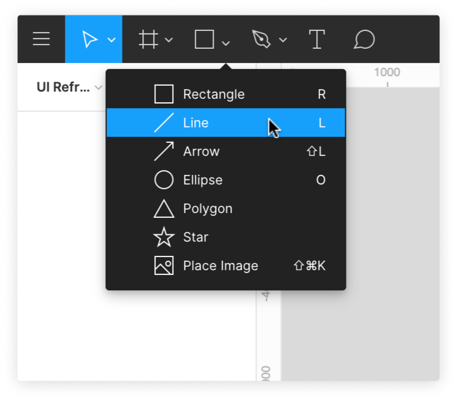

# Utilisation des Outils de Forme

Les formes composent la majorité de vos calques dans n'importe quel design.

Vous pouvez accéder à toutes les formes de base à partir du menu Outils de forme de la barre d'outils. Cliquez sur la flèche vers le bas à côté du Rectangle pour afficher vos options.

Six Outils de forme sont à votre disposition :

1. Outil Rectangle
2. Outil Ligne
3. Outil Flèche
4. Outil Ellipse
5. Outil Polygone
6. Outil Étoile

Pour les designs nécessitant des formes uniques ou complexes, vous pouvez créer vos propres [Réseaux de Vecteurs](https://help.figma.com/article/63-vector-networks) en utilisant l'outil Stylo (icone de Plume) de Figma.

**Astuces pour créer des formes**

- Maintenez la touche Maj enfoncée tout en faisant glisser pour créer des carrés, des cercles et des polygones parfaits.
- Maintenez la touche Option enfoncée pour créer et redimensionner la forme à partir de son centre.
- Maintenez les touches Maj et Option enfoncées pour faire les deux.

## Outil Rectangle

Vous pouvez utiliser l'outil Rectangle pour créer des _Rectangles_ et des _Carrés_.

1. Sélectionnez l'outil **Rectangle** à partir des Outils de Forme, ou utilisez le raccourci clavier `R`

2. Cliquez sur un point dans le canevas et tirez-le pour créer le Rectangle :
  
3. Les dimensions des Rectangles sont affichées en bleu sous le bord inférieur :
4. Une poignée sera présente dans chaque coin de la forme, vous permettant de redimensionner la forme comme vous le souhaitez.

## Outil Ligne

L'outil Ligne vous permet de créer des lignes dans n'importe quelle direction. Les lignes sont un moyen efficace de diviser le contenu dans un design ou de simuler des bordures CSS.

1. Sélectionnez l'Outil**Ligne** dans les Outils de Forme ou utilisez le Raccourci Clavier `L` :
    
2. Cliquez sur un point du canevas et faites-le glisser pour créer la Ligne :
    
3. Une fois une Ligne créée, vous pouvez modifier son apparence dans la section **Contour** du Panneau Propriétés :
    
    1. Réglez la _Couleur_ et l'_Opacité_ du Contour à l'aide du Sélecteur de Couleurs.
    2. Mettez à jour l'**Épaisseur** pour modifier l'épaisseur de la Ligne et choisissez l'emplacement pour l'**Alignement** de l'épaisseur de la Ligne. Vous pouvez l'appliquer à l'_Intérieur_, à l'_Extérieur_ ou au _Centre_ de la Ligne.
    3. Les options **Contour avancé** vous permettent de personnaliser davantage la ligne, notamment en déterminant la **Limite** (l'apparence de chaque extrémité de la ligne) et **Rejoindre** (le comportement de la ligne lorsqu'elle est connectée à aux autres lignes), ainsi que lors de l'utilisation du paramètre **Tirets** pour créer une ligne sous forme de tirets.

## Outil Flèche

L'Outil Flèche vous permet de tracer des flèches dans un sens ou à double sens.

1. Sélectionnez l'Outil **Flèche** dans les Outils de Forme ou utilisez le Raccourci Clavier `⇧ + L` :
    
2. Cliquez sur un point du canevas et faites glisser pour créer la Flèche. Vous pouvez déplacer le curseur sur le canevas pour changer la direction.
3. Comme l'Outil Ligne (ci-dessus), vous pouvez modifier les propriétés de **Contour**.

### Ajouter ou modifier une seule limite

1. Double-cliquez sur la ligne pour entrer dans le _Mode Modification de Vecteur_
2. Sélectionnez le point que vous souhaitez ajouter à la Limite. Vous devez vous assurer d'utiliser l'outil **Déplacer** V.
3. Vous pouvez sélectionner plusieurs points dans une forme en cliquant et en faisant glisser ou en utilisant les raccourcis ci-dessous :
    - Windows : Alt
    - macOS : Maj
4. Ouvrez le menu **Contour avancé** en cliquant sur les trois points dans les paramètres **Contour** :
5. Sélectionnez la **Limite** que vous souhaitez utiliser dans le champ déroulant : 

## Outil Ellipse

Vous pouvez utiliser l'outil Ellipse pour tracer des Ovales et des Cercles. Ils peuvent être utilisés tels quels, ou manipulés pour créer des formes personnalisées avec des courbes.

1. Sélectionnez l'Outil **Ellipse** dans les Outils de Forme ou utilisez le Raccourci Clavier `O` :
    
2. Cliquez sur un point du canevas et faites glisser pour créer l'Ellipse. Les dimensions de la forme s'affichent en bleu sous l'objet :
    
3. Une boîte englobante bleue entoure l'ellipse, avec une poignée dans chaque coin, ce qui vous permet de redimensionner la forme que vous souhaitez

## Outil Polygone

L'Outil Polygone vous permet de tracer une forme fermée composée d'un nombre quelconque de lignes droites.

La forme par défaut de l'outil Polygone est un Triangle, mais vous pouvez ajouter des points supplémentaires à l'objet pour créer vos propres polygones personnalisés.

1. Sélectionnez l'outil **Polygone** dans la liste Outils de Forme :
    
2. Cliquez sur un point du canevas et faites glisser pour créer le Polygone. Les dimensions de la forme s'affichent en bleu sous l'objet.
3. Une boîte englobante bleue entoure la forme, avec une poignée dans chaque coin, ce qui vous permet de redimensionner la forme que vous souhaitez
4. Vous pouvez accéder au _Mode Modification de Vecteur_ en double-cliquant sur le Polygone, ce qui vous permet d'ajouter des points supplémentaires au Polygone et de manipuler chaque point individuellement :  
    
5. Comme pour la forme _Rectangle_, vous pouvez également arrondir les coins d'un Polygone :
    1. Passez le curseur sur la poignée dans le coin jusqu'à ce que le symbole **Rayon** s'affiche : 
    2. Cliquez sur la poignée et faites-la glisser vers le centre de l'objet pour arrondir les coins.

### Polygones et Boîtes Englobantes

Vous avez peut-être remarqué que lorsque nous avons dessiné notre Polygone, dans le cas présent un Triangle, la _boîte englobante_ bleue autour de la forme s'étendait bien en dessous du bas de la forme.

Cela permet à la _boîte englobante_ de conserver une forme ou une taille cohérente, lorsque des points supplémentaires sont ajoutés au Polygone. 
  
Pour aligner la _boîte englobante_ sur la véritable bordure de la forme, vous pouvez **Aplatir** la forme. Vous pouvez y accéder en cliquant avec le bouton droit de la souris sur la forme et en choisissant **Aplatir**, ou en utilisant le raccourci

- **Mac :**   `Commande E`
- **Windows :**   `Ctrl + E`

## Outil Étoile

L'Outil Étoile crée des Polygones disposés en forme d'Étoile. Lorsque vous créez une Étoile, la valeur par défaut est une étoile à 5 branches avec 10 côtés.

1. Sélectionnez l'Outil **Étoile** dans la liste des Outils de Forme : 
    
2. Cliquez et faites glisser sur un point du canevas et faites glisser pour créer l'Étoile :
    
3. Vous pouvez désormais utiliser trois poignées pour manipuler l'Étoile :
    - Le **Nombre** détermine le nombre de points de l'Étoile (min. : 3, max. : 60) : 
    - Le **Ratio** détermine la distance entre les points intérieurs de l'Étoile depuis le centre. Cela s'exprime sous forme de pourcentage du diamètre total de l'Étoile.
    - Le **Rayon** vous permet d'arrondir le point, de la même manière que le _Rayon d'Angle_ fonctionne sur un Rectangle.

**Astuce !** Lorsque vous entrez dans le _Mode Modification de Vecteur_, vous pouvez régler le _Rayon_ de chaque point individuellement.
