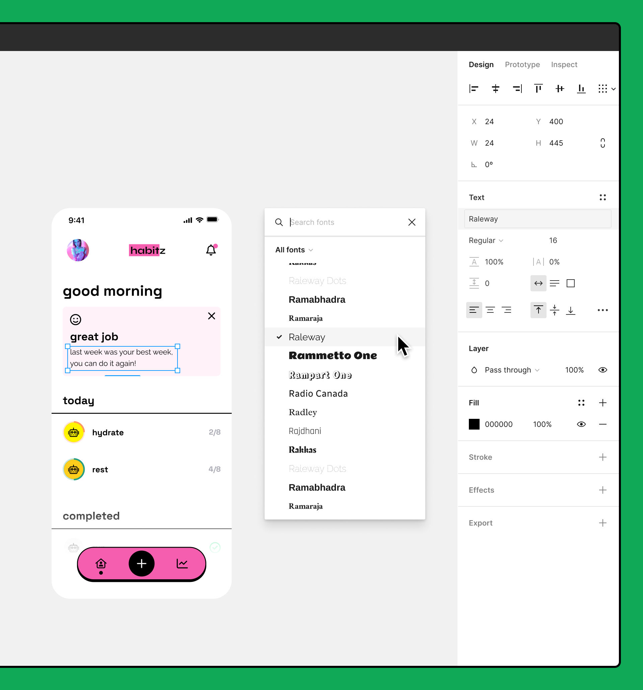
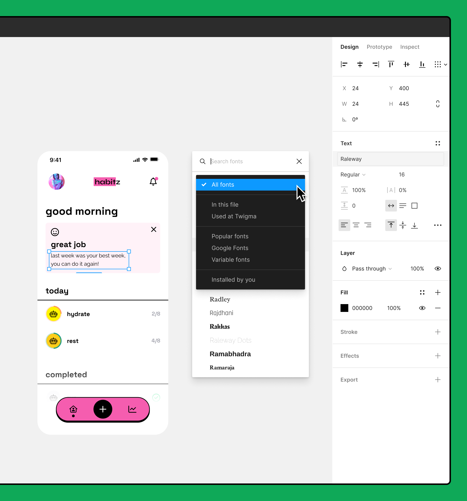

# Les propriété de textes

## Accéder aux polices locales sur votre ordinateur

Compatible avec les ordinateurs et appareils exécutant Windows ou MacOS.

**Attention :** Figma ne prend pas en charge les polices locales sous ChromeOS ou Linux. Les utilisateurs de Chromebook et Linux peuvent uniquement utiliser les polices Web de Google.

Figma vous donne accès à un catalogue de [Polices Web Google](https://fonts.google.com/), que vous pouvez utiliser sans avoir à installer quoi que ce soit.

Si vous avez acheté vos propres polices ou disposez d'un catalogue de polices sur votre ordinateur, vous pouvez également les utiliser dans Figma. Pour permettre à Figma d'accéder à ces polices, il vous faudra les ajouter ou les installer sur votre appareil :

- **Mac** : [Comment installer et supprimer des polices sur votre Mac](https://support.apple.com/en-us/HT201749) (via Apple)
- **Windows** : [Ajouter une police](https://support.microsoft.com/en-us/office/add-a-font-b7c5f17c-4426-4b53-967f-455339c564c1) (via Microsoft)

Pour accéder à ces polices dans le sélecteur de polices, il vous faudra utiliser l'[application de bureau Figma](#application-de-bureau-figma) ou installer [le service de polices Figma](#installer-le-service-de-polices)

### Application de bureau Figma

FigmaAgent est un programme d'arrière-plan sécurisé que Figma installe également lorsque vous [installez l'application de bureau](https://help.figma.com/hc/en-us/articles/360039823654). Il permet à Figma d'accéder aux polices sur votre ordinateur et [d'ouvrir les liens Figma dans l'application de bureau](https://help.figma.com/hc/en-us/articles/360039824334).

Si vous utilisez l'[application de bureau Figma](https://help.figma.com/hc/en-us/articles/360039823654), vous trouverez vos polices locales dans le sélecteur de polices :

1. Sélectionnez un calque de texte ou une partie du texte dans un calque de texte.
2. Figma affiche les Propriétés de **texte** dans la barre latérale de droite.
3. Cliquez à droite de la police pour parcourir votre liste de polices.
4. Cliquez sur une famille de polices pour la sélectionner. Vous pourrez ensuite ajuster d'autres propriétés de texte, telles que le style, la taille, la hauteur de ligne, l'espacement des lettres, etc. **[Pour en savoir plus sur les propriétés de texte →](https://help.figma.com/hc/en-us/articles/360039956634)**

FigmaAgent exécute un serveur HTTP et HTTPS sur [localhost](https://en.wikipedia.org/wiki/Localhost). Il n'autorise que les connexions depuis `figma.com` et n'est pas exposé à l'Internet public.

Il se peut que des événements liés à FigmaAgent apparaissent dans le journal de votre console ou lors de la surveillance de l'activité sur votre ordinateur. L'adresse de bouclage pour localhost est résolue sur `127.0.0.1`.

### Figma via le navigateur

Si vous utilisez Figma via le navigateur, il vous faudra installer manuellement le service de polices Figma. Il s'agit d'un programme d'arrière-plan sécurisé qui permet à Figma d'accéder à toutes les polices de votre ordinateur et les rend disponibles dans le sélecteur de polices.

#### Installer le service de polices

Remarque : Le service de polices Figma nécessite la même configuration que pour l'utilisation de Figma via le navigateur. [Pour en savoir plus sur la configuration requise du navigateur pour Figma →](https://help.figma.com/hc/en-us/articles/360039827194)

1. Téléchargez le service de polices depuis la [page des téléchargements de Figma →](https://www.figma.com/downloads/)
2. Actualisez tous les onglets Figma pour accéder aux polices locales dans le sélecteur de polices.

#### Désinstaller le service de polices

Pour supprimer le service de polices de votre ordinateur, vous devez exécuter le programme de désinstallation.

##### Windows

En fonction du moment où vous avez installé Figma, il est possible que vous ayez une version antérieure du service des polices. Désinstallez l'un des programmes suivants de la section programmes du Panneau de configuration Windows :

- Service Figma
- Aide relative aux polices Figma
- Figma Agent

Pour désinstaller un programme sous Windows :

1. Ouvrez le Panneau de configuration Windows
2. Sélectionnez **Programmes > Programmes et fonctionnalités**.
3. Faites un clic-droit sur le programme et sélectionnez**Désinstaller**. Suivez les instructions à l'écran.

##### Mac

1. Ouvrez **Terminal.app**
2. Collez dans la commande suivante :
  /bin/bash -c "$(curl -fsSL https://desktop.figma.com/agent/mac/uninstall.sh)"

**Police manquante ou autres problèmes de caractères ?** [Dépannage des problèmes courants liés aux polices →](https://help.figma.com/hc/en-us/articles/4403018301079)

## Appliquer des polices

Le texte fait partie intégrante du design d'une interface. Le choix de la police appropriée peut jouer un rôle déterminant dans la lisibilité et l'apparence de votre design.

Pendant que vous éditez le texte, vous pouvez appliquer des polices à :

- tout texte contenu dans un calque de texte ;
- un nombre donné de calques de texte sélectionnés ;
- une chaîne de texte contenue dans un calque de texte.

Pendant que vous appliquez des polices, vous pouvez rechercher une police par son nom ou utiliser les options de filtrage pour parcourir les collections de polices :

- **Search :** utilisez ce champ pour effectuer une recherche par nom dans la liste des polices.
- **All fonts :** cette option affiche toutes les polices auxquelles vous avez accès, y compris les polices locales, les polices partagées et les polices fournies par Figma.
- **In this file :** les polices utilisées dans le fichier en cours
- **Popular :** une liste des polices couramment utilisées, gérée par Figma
- **Used at \[your organization\] :** [polices partagées](https://help.figma.com/hc/en-us/articles/360039956774-Upload-custom-fonts-to-an-organization) qui ont été chargées par votre organisation
- **Installed by you :** polices locales que vous avez installées sur votre ordinateur
- **Google fonts :** polices accessibles dans Figma via Google Fonts
- **Variable fonts :** toutes [les polices comportant au moins un axe de police variable](https://help.figma.com/hc/en-us/articles/5579502031511-Use-variable-fonts)

### Parcourir et appliquer les polices

Parcourez et appliquez des polices depuis la section **Text** de la barre latérale de [d](https://help.figma.com/hc/en-us/articles/360039832014)roite :

1. Sélectionnez un calque de texte, ou du texte contenu dans ce calque, afin d'ajuster ses propriétés.
2. La police actuelle s'affiche au sommet de la section **Text**. Cliquez sur le nom de la police pour ouvrir le sélecteur de police.
3. Recherchez ou sélectionnez une police dans la liste, ou cliquez sur **All fonts** pour sélectionner un filtre.
4. Cliquez sur pour fermer la fenêtre et revenir aux canevas.

Figma retiendra le dernier filtre de police utilisé pour chaque session.

[En savoir plus sur l'utilisation du texte dans Figma →](https://help.figma.com/hc/en-us/sections/360006606853-Typography)