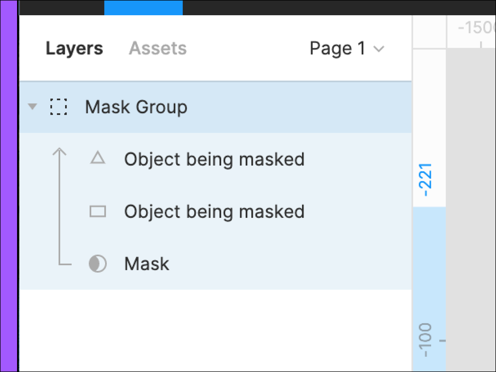
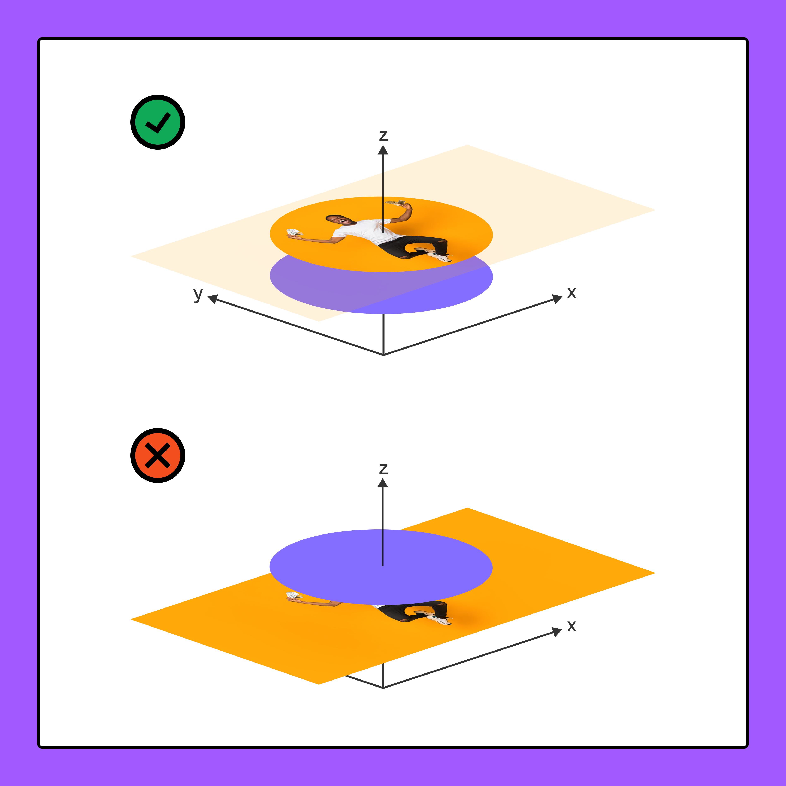
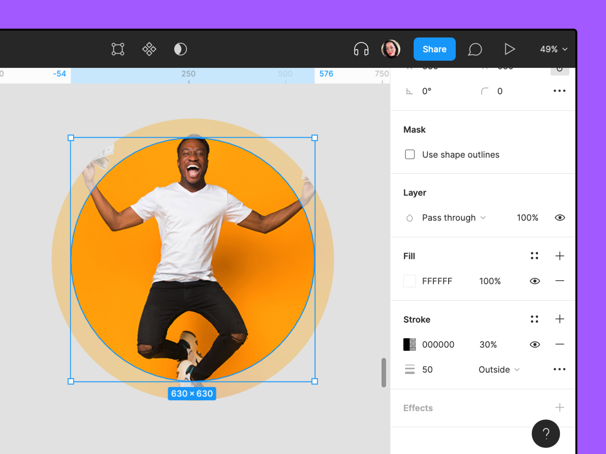
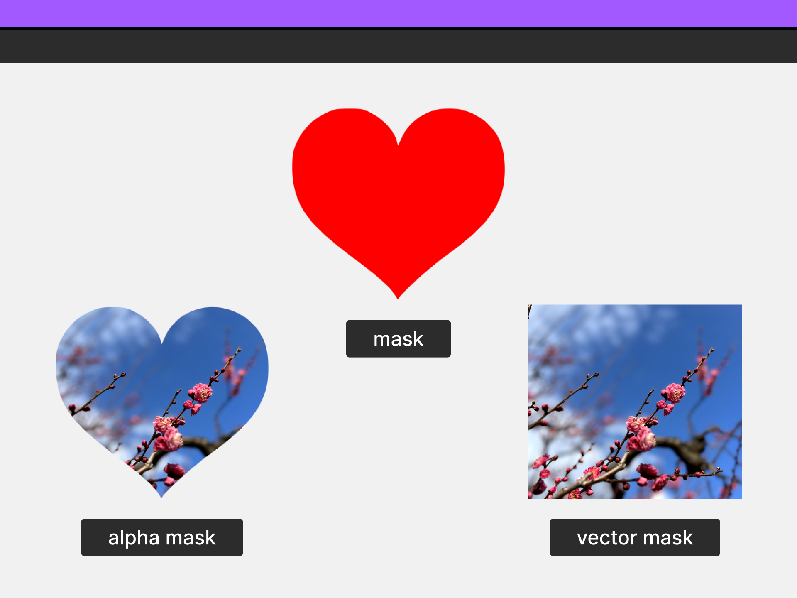
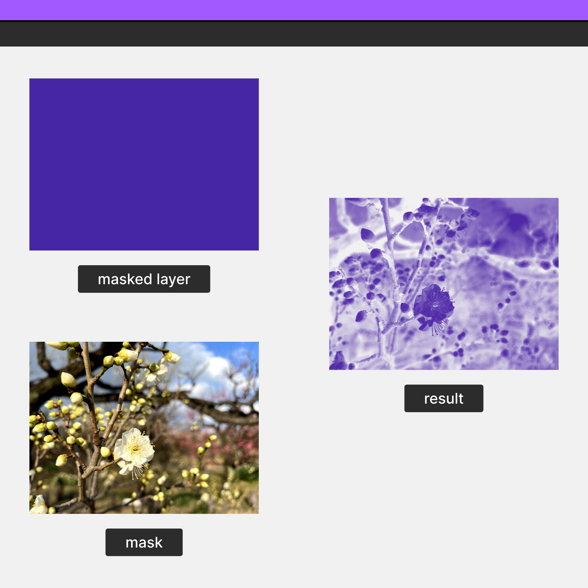
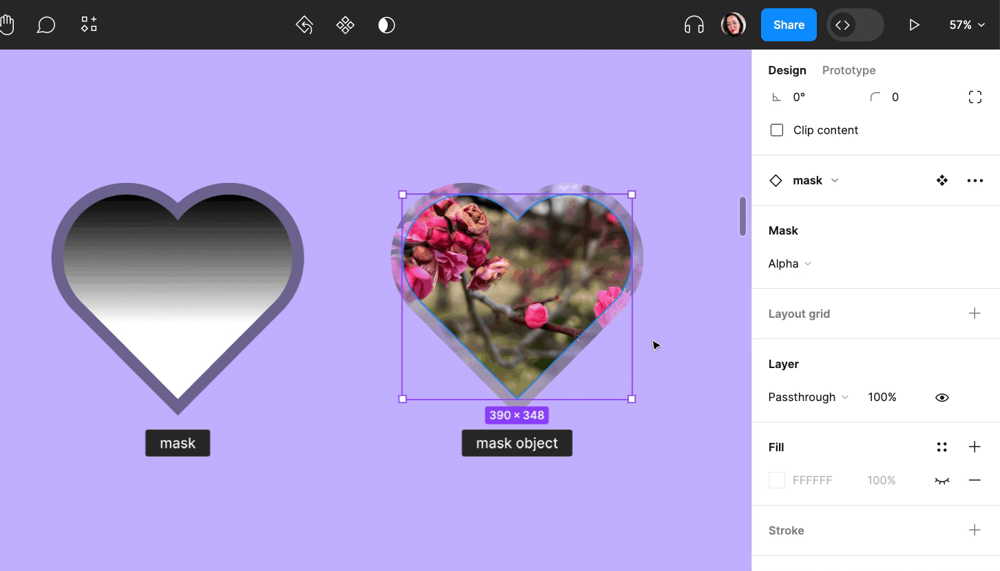
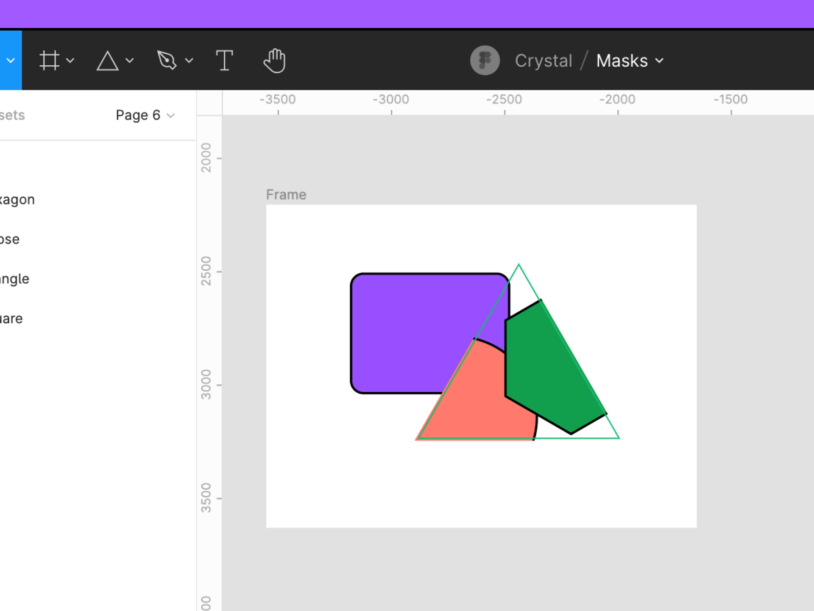

# Les Masques

Les masques permettent d'afficher des zones spécifiques d'objets, tout en masquant le reste.

Cela revient à glisser une photo dans un cadre disposant d'une petite fenêtre d'ouverture : seule une partie de cette photo sera visible à travers l'ouverture, tandis que le reste sera caché, vous évitant ainsi d'avoir à découper la photo pour en réduire la taille.

Les calques masqués n'étant aucunement modifiés ni supprimés au cours de ce processus, les masques n'exercent aucune action destructive. Ils vous permettent de préserver les zones cachées sans avoir besoin de les rogner pour les ajuster.

## Comment utiliser les masques

Tout calque peut faire office de masque, notamment les formes vectorielles, les calques de texte, les images avec des canaux de transparence, des groupes et plus encore.

Lorsque vous utilisez un calque en tant que masque, un **objet masque** est créé. Cet objet inclut le masque et tous les calques qu'il masque. Le panneau des calques permet d'identifier un objet masque, grâce au symbole en bas, , qui représente un masque, et à une flèche vers le haut longeant les calques actuellement masqués.

Les masques sont placés sous les calques masqués sur l'axe Z. Un masque s'applique à tous les frères et sœurs au-dessus de lui, jusqu'à ce qu'il atteigne :

- un autre masque ou objet masque ;
- le groupe ou cadre parent du masque ;
- un cadre ou composant dont l'option "Cacher le contenu extérieur" est activée.

Dans l'exemple ci-dessous, l'ellipse violette fait office de masque. Si le masque se trouve sous l'image de la personne sur l'axe Z, il masquera cette image. Si le masque se trouve au-dessus de l'image, cette dernière ne sera pas masquée.

## Types de masque

### Alpha

Dans Figma, tous les masques prennent en charge les canaux Alpha. Ces canaux Alpha représentent le degré de transparence ou d'opacité d'une couleur, d'une image ou d'un objet.

Lorsque vous travaillez avec des masques Alpha, ces masques sont appliqués en fonction de l'opacité du masque. Plus l'opacité est forte, moins le masque cache. Une opacité de 0 % ne laisse rien transparaitre.

Nous pouvons donc nous servir des flous et de l'opacité pour masquer :

- Importer des fichiers PNG, GIF et WebP existants avec transparence (canaux Alpha)
- Utiliser des effets de flou de calque pour répliquer un adoucissement de contours
- Appliquer des ombres internes et portées pour créer une certaine profondeur
- Ajouter des remplissages, des contours et des dégradés d'opacité variables

Dans l'exemple ci-dessous, nous avons utilisé une ellipse avec un contour externe en guise de masque. L'opacité du remplissage de l'ellipse est de 100 %, tandis que l'opacité du contour est de 30 %. Le centre de l'image est plus visible, car l'opacité du masque y est plus élevée (100 %).

### Vecteur

Les masques vectoriels, ou l'utilisation de contours de forme en tant que masques, ignorent la translucidité — c'est-à-dire les valeurs d'opacité supérieures à 0 % — des contours ou remplissages de masque. Si la moindre zone d'un masque présente une opacité supérieure à 0 %, ses contours sont utilisés comme masque et le masque entier présente une opacité de 100 %.

Dans l'exemple ci-dessous, l'image d'un cœur à l'arrière-plan complètement transparent est utilisée comme masque. L'objet en bas à gauche utilise un masque Alpha, d'où sa forme de cœur. L'objet en bas à droite utilise un masque vectoriel, et il utilise le contour de l'image entière comme masque.

### Luminosité

La luminosité permet d'utiliser la clarté pour déterminer un masque. Plus la zone d'un masque est claire, moins le masque cache. En d'autres termes, plus l'opacité des calques est masquée.

Plus la zone est sombre, plus le masque cachera. Si un masque dispose d'un remplissage noir, soit `#000000`, il ne révélera rien et les calques masqués présenteront une opacité de 0 %.

## Création et modification de masques

### Création d'un masque

1. Choisissez l'objet que vous souhaitez utiliser comme masque, puis placez-le derrière tous les objets à masquer sur l'axe Z.
2. Sélectionnez tous les calques à inclure dans l'objet masque.
3. Créez l'objet masque en cliquant sur  dans la barre d'outils du haut, ou appuyez sur :  
    - pour Mac : `⌃ Contrôle ⌘ Commande M`
    - pour Windows : `Ctrl Alt M`
4. Par défaut, le type de masque est défini sur **Alpha**. Pour le modifier, sélectionnez le calque actuellement utilisé comme masque, puis ouvrez la liste déroulante dans la section Masque de la barre de droite. Placez ensuite le pointeur de la souris sur une option pour en prévisualiser le rendu sur le canevas.

Pour ajouter des calques à un objet masque existant, utilisez le panneau des calques pour cliquer sur ces calques et les déplacer vers l'objet masque en question.

### Redimensionnement et déplacement

Vous pouvez déplacer et redimensionner les masques et les calques masqués indépendamment les uns des autres. Cela signifie que lorsque vous déplacez ou redimensionnez un masque, aucun des calques masqués n'en sera affecté, et inversement.

Parce qu'ils appartiennent à la même fratrie, les masques ne se comportent pas comme des parents, contrairement à un cadre, un groupe ou un composant.

### Suppression d'un masque

Pour arrêter d’utiliser un objet en tant que masque, utilisez l'une des méthodes suivantes pour le désactiver :

- Sélectionnez le masque et cliquez sur dans la barre d'outils du haut.
- Cliquez avec le bouton droit de la souris sur le masque et sélectionnez l'option **Utiliser en tant que masque.**
- Sélectionnez le masque et utilisez le raccourci clavier suivant :
  - pour Mac : `⌃ Contrôle ⌘ Commande M`
  - pour Windows : `Ctrl Alt M`

Toute partie cachée par le masque réapparaitra.

## Affichage des contours de masque

Par défaut, Figma n'affiche pas les lignes frontière des masques. Utilisez des contours de masque lorsque vous utilisez des masques complexes ou pour vérifier la présence d'espaces involontairement vides.

Pour activer les contours de masque, procédez comme suit :

1. Ouvrez le menu Figma.
2. Accédez à **Afficher > Contours de masque**.

Une fois ce paramètre activé, le contour des masques de votre fichier s'affichera en vert.

> **Remarque :** si tous les calques masqués sont cachés ou que leur opacité est de 0 %, le contour des masques ne s'affichera pas.
