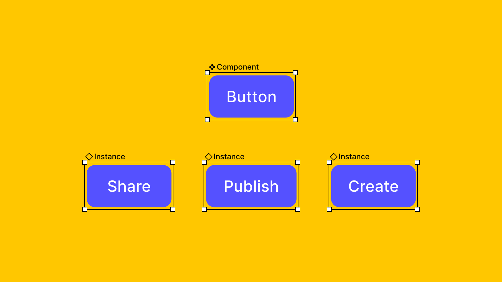

# Créer et insérer des instances de composant

Les composants sont des éléments d'UI que vous pouvez réutiliser dans vos designs.

- Le **composant principal** définit les propriétés de l'élément.
- L'**instance** est un exemplaire du composant que vous pouvez réutiliser dans vos designs.

Il existe plusieurs façons de créer et d'insérer des instances de composants dans vos designs :

- À partir du panneau des ressources dans la barre latérale gauche
- À partir de la fenêtre modale des détails du composant, accessible dans le panneau des ressources
- À l'aide de l'insertion rapide
- En copiant ou dupliquant une instance

**Astuce :** vous pouver envoyer des instances pour le développement sans réorganiser votre fichier en [marquant les instances comme prêtes pour le développement dans le Dev Mode →](https://help.figma.com/hc/en-us/articles/15023124644247-Guide-to-Dev-Mode#View_which_sections_are_ready_for_development)

## Panneau des ressources

Situé dans la barre latérale gauche, le panneau des **ressources** vous permet de rechercher des composants à ajouter à votre fichier. Vous pouvez choisir les bibliothèques disponibles dans le panneau des **ressources**.

Pour ouvrir le panneau des ressources, procédez comme suit :

1. Sélectionnez l'onglet **Assets** dans la barre latérale gauche, ou utilisez le raccourci suivant :
    - **Mac** : `⌥ Option 2`
    - **Windows :** `Alt 2`
2. Recherchez le composant que vous souhaitez utiliser :
    - Consulter les **composants locaux** créés dans le fichier actuel
    - Explorez les composants des bibliothèques activées et ouvrez la fenêtre modale **[Library](https://help.figma.com/article/29-team-library)** pour gérer les bibliothèques disponibles
    - Consultez les composants locaux privés et tous les composants **utilisés dans le fichier**
    - Utilisez et pour basculer entre les vues grille et liste
    - Utilisez le champ de recherche pour rechercher des composants dans les bibliothèques auxquelles vous avez accès, y compris les bibliothèques d'équipes ou d'organisations et les fichiers pour lesquels vous disposez au moins d'un accès **peut voir**
    - Passez le curseur de la souris sur un composant pour afficher le nombre de [variantes](https://help.figma.com/hc/en-us/articles/360056440594) disponibles, le cas échéant
    - Cliquez sur un composant pour ouvrir la fenêtre modale des détails du composant
3. Cliquez et faites glisser le composant sur le canevas pour en créer une instance.

> Astuce : appuyez sur Tab pour naviguer entre les ressources dans le panneau des ressources. Appuyez surEntrée pour insérer une ressource sélectionnée dans le fichier.

- [Gérer les bibliothèques pour vos brouillons](https://help.figma.com/hc/en-us/articles/360038743434)
- [Gérer les bibliothèques dans les fichiers de design](https://help.figma.com/hc/en-us/articles/1500008731201)
- [Gérer les bibliothèques dans les équipes](https://help.figma.com/hc/en-us/articles/360039234953)
- [Gérer les bibliothèques d'organisation par défaut](https://help.figma.com/hc/en-us/articles/360040530413)

## Fenêtre modale des détails du composant

La fenêtre modale des détails du composant fournit les informations suivantes :

- Documentation du composant
- Bibliothèque contenant le composant
- Aperçu de l'état par défaut du composant

Si vous disposez de l'accès peut éditer à une bibliothèque dans une équipe payante, vous disposez également de l'accès à l'initiation aux composants. L'initiation aux composants vous propose des commandes afin de consulter les variantes du composant, ses propriétés et ses modes de variable, ainsi que de les insérer dans le canevas.

1. Sélectionnez l'onglet **Assets** dans la barre latérale gauche ou utilisez le raccourci suivant :
    - **Mac** : ⌥ Option2
    - **Windows :** Alt2
2. Recherchez le composant et sélectionnez-le pour ouvrir la fenêtre modale des détails du composant.
3. Configurez votre composant à l'aide des commandes.
4. Pour insérer l'instance, cliquez sur **Insert instance** ou faites glisser l'aperçu sur le canevas.

## Insertion rapide

Insérez des instances de composants à l'aide de votre clavier en utilisant l'insertion rapide. Cette fonctionnalité ouvre la fenêtre modale des ressources, où vous pouvez rechercher et consulter les composants des bibliothèques activées.

Les composants qui figurent dans la fenêtre modale Resources reflètent le contenu du panneau des ressources. Explorez les composants des bibliothèques auxquelles vous avez accès, y compris :

- Les composants récemment utilisés sur vos fichiers
- Les composants locaux dans le fichier actuel, triés par page
- Tous les composants d'une bibliothèque activée

1. Utilisez le raccourci `Maj I` pour accéder à l'insertion rapide.
2. Pour localiser un composant, procédez comme suit :
    - Recherchez un composant spécifique à l'aide de la barre de recherche ou naviguez vers ce composant à l'aide des touches fléchées.
    - Utilisez les icônes et pour basculer entre les vues grille et liste.
    - Sélectionnez un composant parmi les derniers utilisés dans vos fichiers ou à partir d'une biliothèque activée. Si une bibliothèque ne s'affiche pas, vous devrez peut-être l'activer. **[Gérer les bibliothèques dans les fichiers de design →](https://help.figma.com/hc/en-us/articles/1500008731201)**
3. Pour échanger, sélectionnez ou passez le curseur de la souris sur l'instance, puis maintenez la touche ⌥ Option (Mac) ou Ctrl (Windows). **[Échanger des composants et des instances →](https://help.figma.com/hc/en-us/articles/360039150413)**

## Copier ou dupliquer

### Dupliquer à l'aide du raccourci clavier

Si vous travaillez dans le même fichier, vous pouvez dupliquer un composant pour créer une instance, à l'aide du raccourci suivant :

- **Mac** : `⌘ Command D`
- **Windows** : `Ctrl D`

### Copier par glisser-déposer

Vous pouvez également faire glisser un composant à l'intérieur d'un fichier pour le copier :

1. Maintenez la touche `⌥` Option (Mac) ou `Alt` (Windows) enfoncée et faites glisser pour créer une instance.
2. Relâchez le bouton de la souris **avant** la touche du clavier. Sinon, Figma déplace le composant d'origine au lieu de le dupliquer.

### Copier et coller

Vous pouvez copier-coller un composant au sein d'un même fichier pour créer une instance.

Vous pouvez copier-coller d'un fichier à un autre des instances de composant et des composants principaux publiés.

- **Mac :** `⌘ Command C` et `⌘ Command V`
- **Windows** : `Ctrl C` et `Ctrl V`

## Tutoriel vidéo

Découvrez les tutoriels [vidéo sur les composants](https://youtu.be/k74IrUNaJVk?list=PLXDU_eVOJTx5LSjOmeBYMuvaa4UayfMe4)
