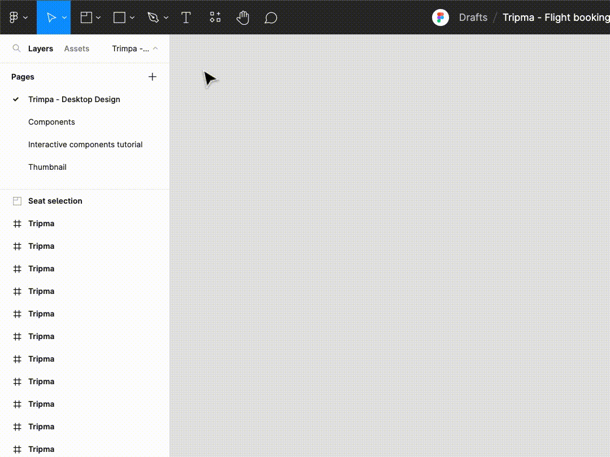
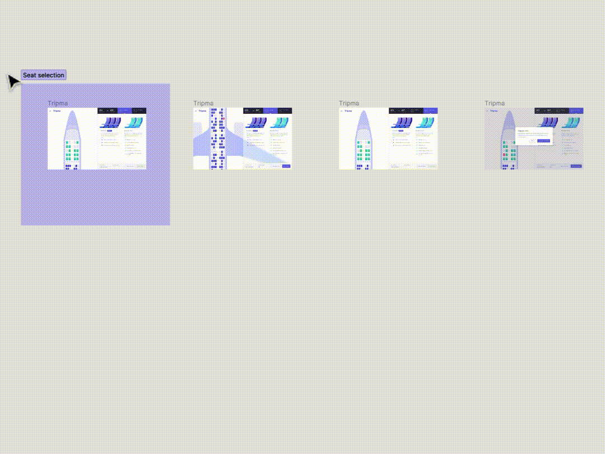
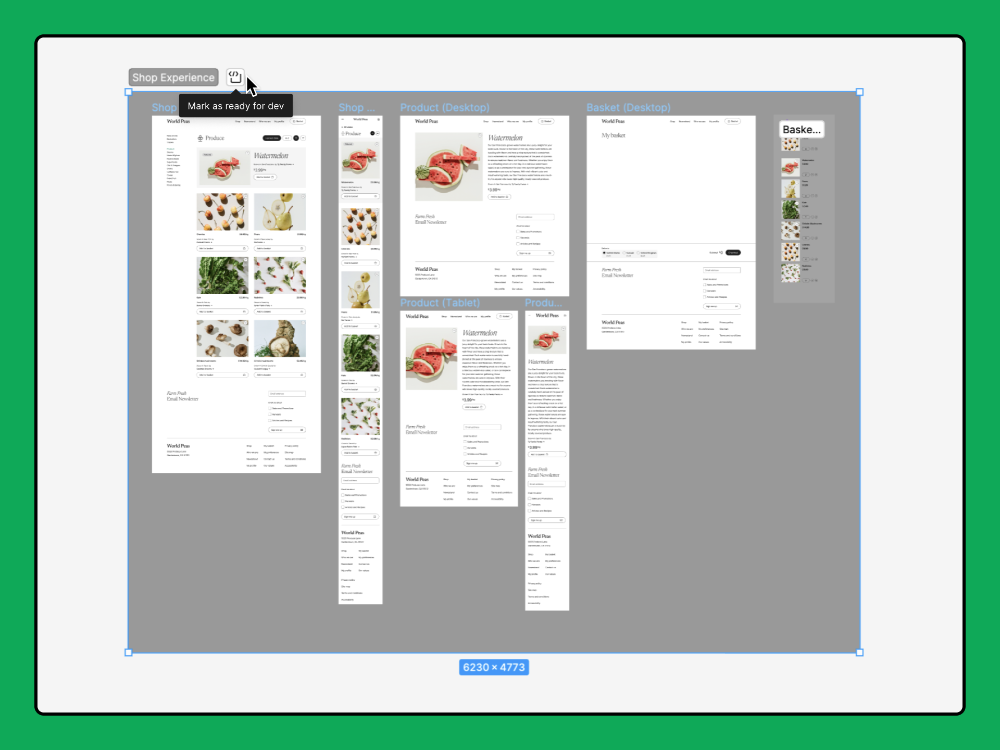

# Organisez vos canevas à l'aide de sections

Organisez vos canevas à l'aide de sections étiquetées pour regrouper des idées connexes et guider les collaborateurs dans votre fichier.

Grâce aux sections, vous pouvez :

- désigner des zones dédiées à la collaboration ou à l'échange d'idées dans vos canevas ;
- organiser les fichiers pour faciliter la navigation ;
- établir un lien vers un regroupement de designs ;
- Marquer le contenu comme « prêt pour le développement » pour faciliter l'envoi aux développeurs

Les sections d'un design Figma sont un élément de premier niveau sur le canevas par défaut. Les sections peuvent contenir tous types de calques, y compris d'autres sections, mais ne peuvent pas être intégrées à des cadres ou à des groupes.

## Créer une section

Il existe plusieurs manières de créer une section :

### Barre d'outils et raccourci

1. Cliquez sur **Section** dans la barre d'outils supérieure ou utilisez le raccourci clavier ⇧ Maj S.
2. Cliquez sur la position désirée de la section afin de la déposer dans les canevas.

Vous pouvez également cliquer sur une section pour la déposer sur les objets dans lesquels vous souhaitez l'ajouter.

### Sélection

1. Sur les canevas, cliquez sur les objets que vous souhaitez ajouter pour les déposer dans une section.
2. Cliquez avec le bouton droit de la souris sur la sélection.
3. Dans le menu, cliquez sur **Créer une section**.

Astuce : double-cliquez sur l'icône d'une section dans le panneau des **Calques** pour y accéder.

## Ajouter des objets à une section

Il existe plusieurs manières d'ajouter des objets à une section :

- Déplacer une section sur un objet
- Redimensionner une section sur un objet
- Sélectionner et déplacer un objet dans une section à l'aide de la souris ou des touches fléchées du clavier

## Modifier une section

### Titre

1. Double cliquez sur le titre de la section sur les canevas ou le panneau des **calques**.
2. Modifiez le titre.
3. Appuyez sur Retour ou Entrée.

### Remplissage et contour

Modifiez la couleur de l'arrière-plan et de la bordure d'une section à l'aide des sections **Remplissage** et **Contour** de la barre latérale droite.

## Partager une section

Vous pouvez orienter les collaborateurs vers une section spécifique de vos canevas en copiant un lien vers cette section.

1. Sélectionnez la section que vous souhaitez partager.
2. Cliquez sur **Partager** dans la barre d'outils supérieure.
3. Cochez la case en regard de **Lien vers la section sélectionnée**.

## Marquer une section comme prête pour le développement

Une fois que le contenu d'une section est finalisé, vous pouvez marquer celle-ci comme prête pour le développement. Ainsi, vous facilitez le travail des développeurs en Dev Mode en leur signalant la section.

Pour marquer une section comme prête pour le développement :

1. Sélectionnez la section.
2. Cliquez sur **Mark as ready for dev**.
3. Pour ne plus marquer une section comme prête pour le développement, cliquez sur le menu à trois points de l'étiquette **Ready for dev** et sélectionnez **Remove ready status**.

Remarque : marquer une section comme prête pour le développement n'empêche pas de modifier son contenu.

## Supprimer une section

Pour supprimer une section et son contenu :

1. Sélectionnez la section.
2. Appuyez sur Suppr/Retour arrière.

Pour supprimer une section sans supprimer son contenu :

1. Sélectionnez la section.
2. Appuyez sur CommandeSuppr/CtrlRetour arrière.

## Prototypes et sections

Dans les prototypes, les sections permettent de connecter les flux entre différentes parties du design.

Lorsque vous créez une connexion à une section, Figma mémorise le dernier cadre consulté dans cette section et y revient automatiquement.

[En savoir plus sur le prototypage à l'aide de sections →](https://help.figma.com/hc/en-us/articles/16194160540567)
