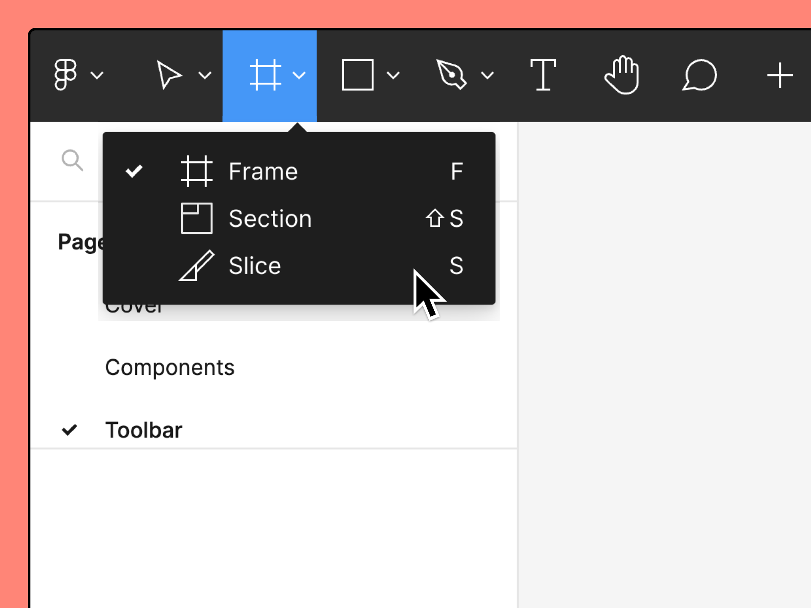
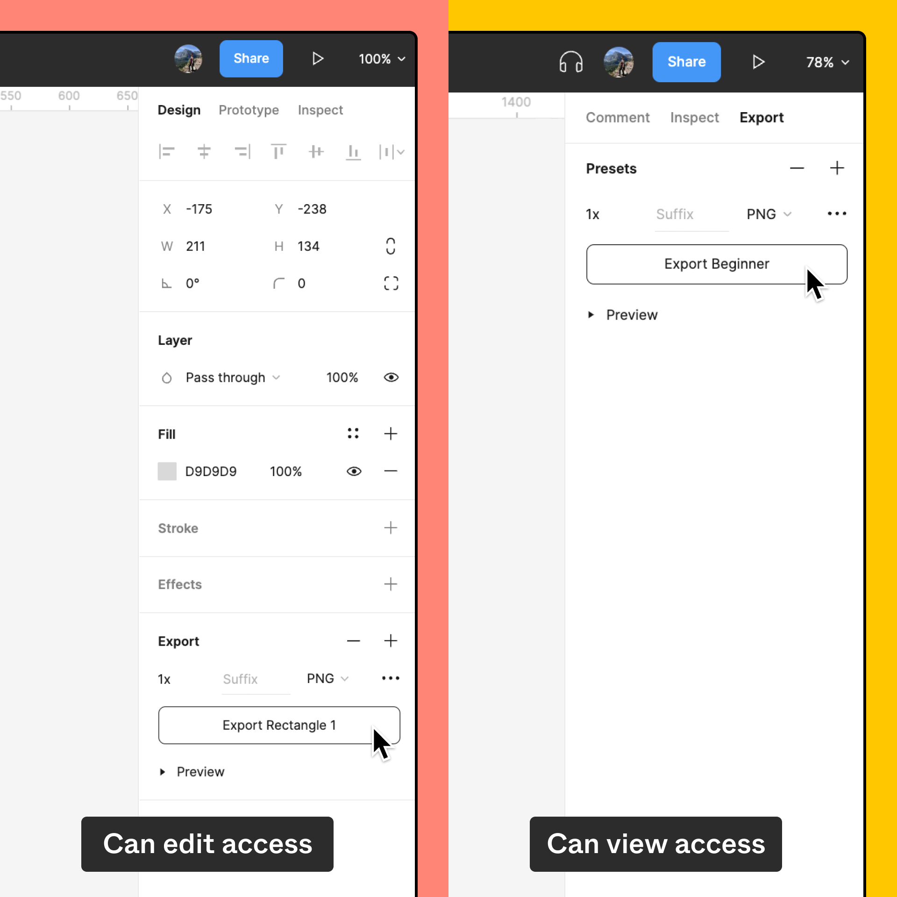

# Exporter depuis Figma

Avant de commencer

Qui peut utiliser cette fonctionnalité

S'applique à [toutes les équipes ou tous les forfaits](https://help.figma.com/hc/en-us/articles/360040328273-Choose-a-Figma-Plan).

Toute personne disposant d'un accès de type peut voir au fichier peut ajouter des paramètres d'exportation et exporter des ressources.

Toute personne disposant d'un accès de type peut éditer au fichier peut utiliser l'outil Tranche.

Vous pouvez exporter vos designs depuis Figma dans différents formats de fichiers et différentes échelles. L'exportation vous permet de partager votre contenu avec d'autres personnes, de déplacer du contenu entre deux outils et d'enregistrer des copies de vos designs en dehors de Figma.

Pour exporter du contenu à partir de Figma :

1. Sélectionnez le contenu que vous souhaitez exporter.
2. Appliquez vos paramètres d'exportation. En savoir plus sur [les formats et paramètres d'exportation de Figma →](https://help.figma.com/hc/en-us/articles/13402894554519)
3. Exporter une sélection spécifique ou exporter du contenu de manière groupée

> Astuce : vous pouvez copier et coller certains objets entre plusieurs outils de design, afin de gagner du temps si vous utilisez plusieurs outils. Découvrir comment [copier des ressources entre plusieurs outils →](https://help.figma.com/hc/en-us/articles/360040030374)

## Sélectionner le contenu à exporter

Sélectionnez le contenu que vous souhaitez exporter. Il peut s'agir d'un calque unique, de plusieurs objets ou de tout le contenu du canevas. Si votre fichier comporte plusieurs pages, vous devez sélectionner et exporter le contenu séparément sur chaque page. En savoir plus sur [la sélection d'objet dans Figma →](https://help.figma.com/hc/en-us/articles/360040449873-Select-layers-and-objects)

Remarque : vous pouvez également exporter votre fichier en totalité au format .fig (design Figma) ou .jam (FigJam). En savoir plus sur [l'enregistrement d'une copie locale d'un fichier →](https://help.figma.com/hc/en-us/articles/8403626871063-Save-a-local-copy-of-files)

### Utiliser l'outil Tranche

Si vous disposez d'un **accès en édition** à un fichier, l'outil Tranche vous offre une autre méthode de sélection du contenu à exporter. L'outil Tranche se trouve dans la liste déroulante Outils de région de la barre d'outils.

Pour créer une tranche, faites glisser l'outil Tranche autour de la région que vous souhaitez exporter. Si besoin, vous pouvez déplacer et redimensionner la tranche. Gardez à l'esprit que seul le contenu apparaissant visuellement dans les limites de la tranche sera exporté. C'est une solution pratique pour créer une image à partir d'une partie de votre design.

Les tranches vous permettent également de contrôler le remplissage. Si vous ne le contrôlez pas vous-même, le remplissage est calculé à partir des limites totales de la forme. Le remplissage s'adapte aux changements de taille de la forme, tandis que la tranche est absolue.

Une fois que vous avez placé la tranche où vous le souhaitez, vous pouvez lui appliquer des paramètres d'exportation, comme à n'importe quel autre objet.

## Appliquer des paramètres d'exportation

Utilisez les paramètres d'exportation pour contrôler la manière dont Figma exporte vos designs.

L'emplacement des paramètres d'exportation varie en fonction de votre niveau d'accès au fichier :

- Les utilisateurs disposant d'un accès de type **peut éditer** trouveront les paramètres d'exportation dans l'onglet **Design** de la barre latérale de droite.
- Les utilisateurs disposant d'un accès de type **peut voir** trouveront les paramètres d'exportation dans l'onglet **Exporter** de la barre latérale de droite.

Remarque : si les paramètres d'exportation ne s'affichent pas, essayez d'actualiser la page. Si cela ne fonctionne pas, il est possible que le propriétaire du fichier ait défini des restrictions empêchant les observateurs de copier ou d'exporter des ressources à partir du fichier. En savoir plus sur [les restrictions relatives à la copie et au partage de fichiers →](https://help.figma.com/hc/en-us/articles/360040045574)

Vous pouvez ajouter autant de paramètres d'exportation que vous le souhaitez pour votre sélection. Il peut s'agir d'une combinaison de différents formats ou de différentes échelles. En savoir plus sur [les formats et paramètres d'exportation de Figma→](https://help.figma.com/hc/en-us/articles/13402894554519)

Pour ajouter un paramètre d'exportation, cliquez sur au sommet de la section Exporter.

Pour supprimer un paramètre d'exportation, cliquez sur au sommet de la section Exporter. Figma supprimera le paramètre d'exportation ajouté en dernier pour l'objet sélectionné.

## Exporter du contenu

### Exporter une sélection

Vous pouvez exporter des sélections la première fois que vous appliquez les paramètres d'exportation, ou en sélectionnant un objet auquel des paramètres d'exportation ont déjà été appliqués.

1. Sélectionnez les calques que vous souhaitez exporter.
2. Ajoutez ou réglez les paramètres d'exportation.
3. Cliquez sur en regard du paramètre Aperçu pour prévisualiser le rendu de votre ressource.
   > Remarque : si vous avez sélectionné plusieurs objets, le paramètre Aperçu ne s'affiche pas.
4. Cliquez sur **Exporter**.

### Exporter de manière groupée

Exportez des ressources de manière groupée à l'aide de la liste d'exportation. Celle-ci inclut toutes les sélections de votre page actuelle auxquelles un paramètre d'exportation a été appliqué.

1. Cliquez sur le menu et sélectionnez **Fichier**, puis **Exporter** dans les options. Vous pouvez également utiliser le raccourci clavier suivant :
    - **macOS :** `Shift + Commande + E`
    - **Windows :** `Maj + Ctrl + E`
2. Le modal Exporter affiche toutes les sélections auquelles des paramètres d'exportation ont été appliqués. Pour chaque sélection, vous pouvez :
    - afficher l'échelle, le format et les dimensions de la ressource ;
    - passer le curseur sur la miniature ou le nom du calque pour afficher le nom du fichier exporté ;
    - cliquer sur la miniature pour afficher cette sélection dans le canevas ;
3. décocher les cases en regard des sélections que vous ne souhaitez pas exporter.
4. Cliquez sur **Exporter** pour exporter les ressources sélectionnées.
