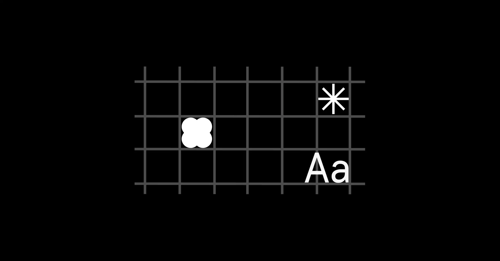
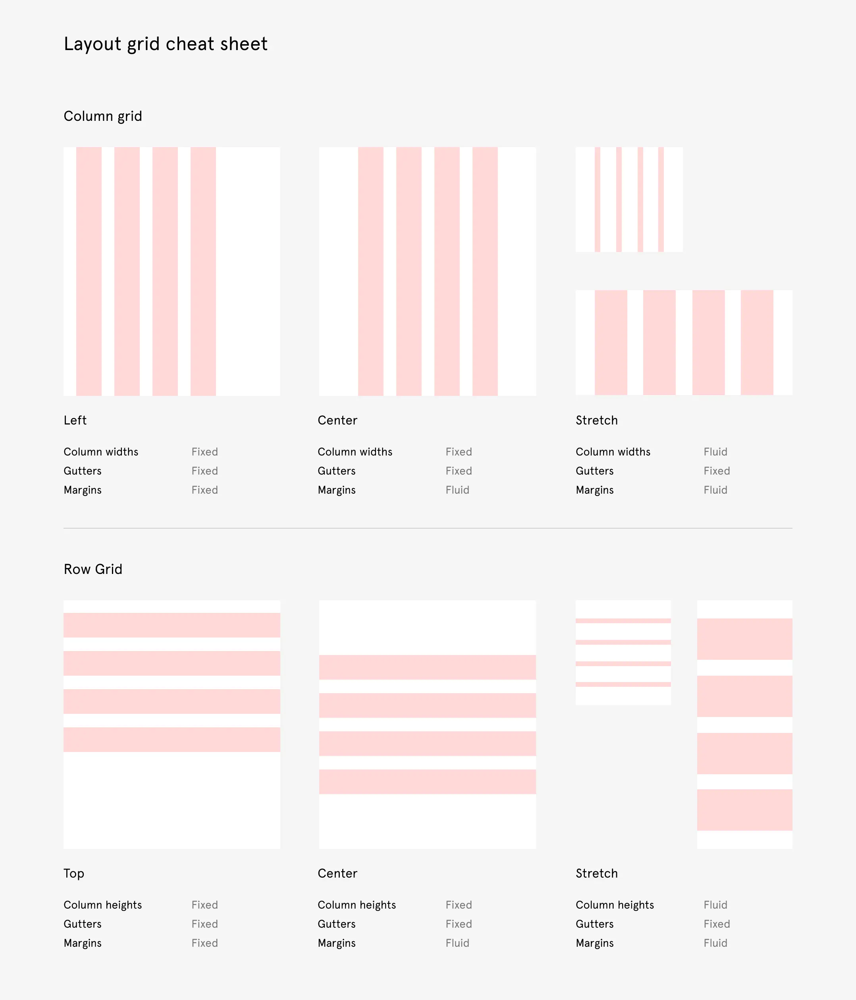
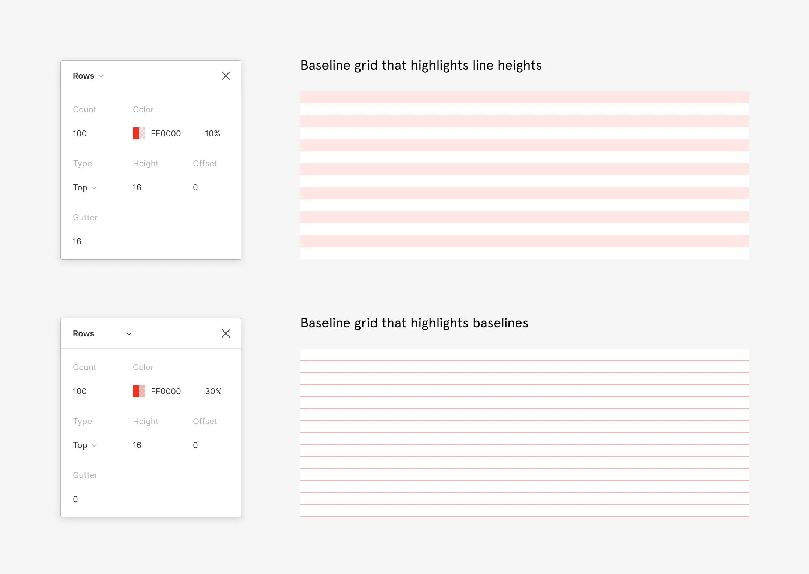
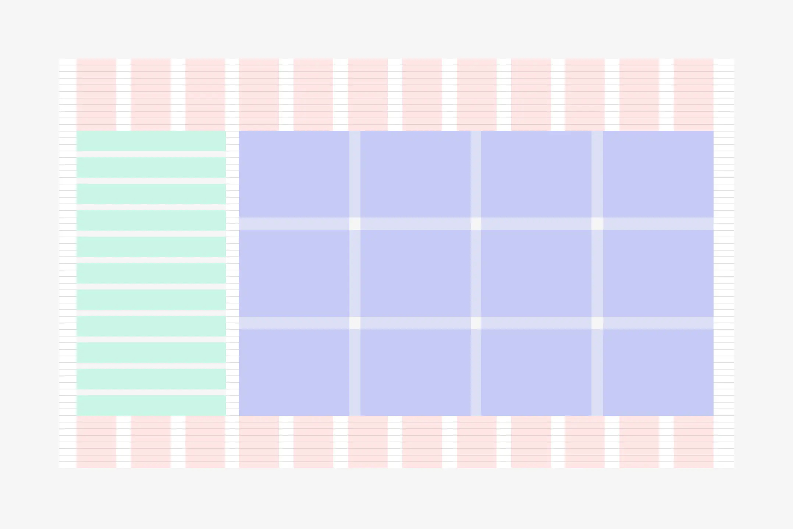

# Création de grilles de mise en page avec des grilles, des colonnes et des lignes

Lors du design de l'écran, un certain nombre de mises en page sont à traiter. La précision et la flexibilité sont nécessaires pour faciliter l'adaptation de nos designs.

La grille de pixels nous donne la précision et le contrôle du positionnement. Une grille de mise en page nous offre une plus grande flexibilité dans la mise en œuvre de nos designs.

[Voir la vidéo sur Youtube](https://youtu.be/zd8wrAdURN0)

## Créer des grilles dans Figma

En construisant soigneusement une grille adaptée à votre contenu, vous pouvez définir une structure, une hiérarchie et un rythme dans votre conception. Lorsqu'il est bien fait, l'échafaudage des grilles peut éliminer le travail de devinette de nombreux aspects de votre processus. Différents types de grilles peuvent également vous aider à établir une approche rationnelle des échelles de caractères, du positionnement, de la taille et de l'espacement.

Dans Figma, vous pouvez appliquer plus d'une grille comme propriété à n'importe quel cadre (et basculer indépendamment sa visibilité). Cela a changé la donne et est rapidement devenu un élément essentiel de mon flux de travail.

## Les basiques d'une grille de mise en page

**Appliquer une grille de mise en page à n'importe quel cadre** - Les grilles de mise en page ne peuvent être appliquées qu'aux cadres cela signifie que vous pouvez les appliquer à n'importe quel cadre de niveau supérieur adapté à un appareil (ordinateur de bureau, mobile, tablette), à des cadres imbriqués dans votre conception ou même à des cadres à l'intérieur de vos composants.

**Plusieurs grilles sur un cadre** - Vous pouvez ajouter autant de grilles de mise en page différentes que vous le souhaitez à un cadre. Cela signifie que vous pouvez empiler différents types de grilles sur un seul cadre. Chacune de ces grilles peut également être sélectionnée et collée sur d'autres cadres puisqu'elles sont appliquées comme d'autres propriétés dans la barre latérale de droite.

**Apparence des grilles** - Vous pouvez contrôler l'apparence (couleur et opacité) de chaque grille afin de les différencier facilement.

## Types de grilles

Il existe trois formes de grilles différentes : 

- la grille
- les colonnes
- les lignes

Les grilles uniformes créent une série de champs uniformément espacés dans votre cadre (imaginez une feuille de papier quadrillé) à la taille que vous spécifiez. Les autres grilles disposent de quelques options supplémentaires pour créer des colonnes et des lignes. À l'intérieur des grilles de colonnes et de lignes, vous pouvez également contrôler leur position et leur mise à l'échelle.

## Grilles de ligne de base

Une grille de "ligne de base" est une grille établie à partir des lignes sur lesquelles repose votre typographie.

 Celles-ci apparaissent comme des aides visuelles dans votre conception, s'étendant sur la largeur de votre cadre et se répétant verticalement à un intervalle régulier. Cet intervalle dépend en grande partie des échelles et des hauteurs de ligne de votre typographie. Dans de nombreux systèmes de grille de 8 pt, une ligne de base de 4 pt est utilisée. Cette unité de base rend les calculs faciles et évolutifs lorsque vous commencez à configurer différentes tailles de caractères et combinaisons de hauteurs de lignes.

## Grilles imbriquées

Contrairement à d'autres outils, Figma ne vous limite pas à une seule grille au niveau de la planche d'art. Comme vous pouvez appliquer une grille à n'importe quel cadre, cela signifie que vous pouvez l'appliquer à des cadres imbriqués dans votre dessin.

Une fois que vous commencez à exploiter cette possibilité, il existe une infinité de façons d'utiliser les grilles comme aides visuelles dans des zones particulières de votre dessin ou modèle. Vous pouvez les différencier en spécifiant la couleur et l'opacité de chaque grille.

