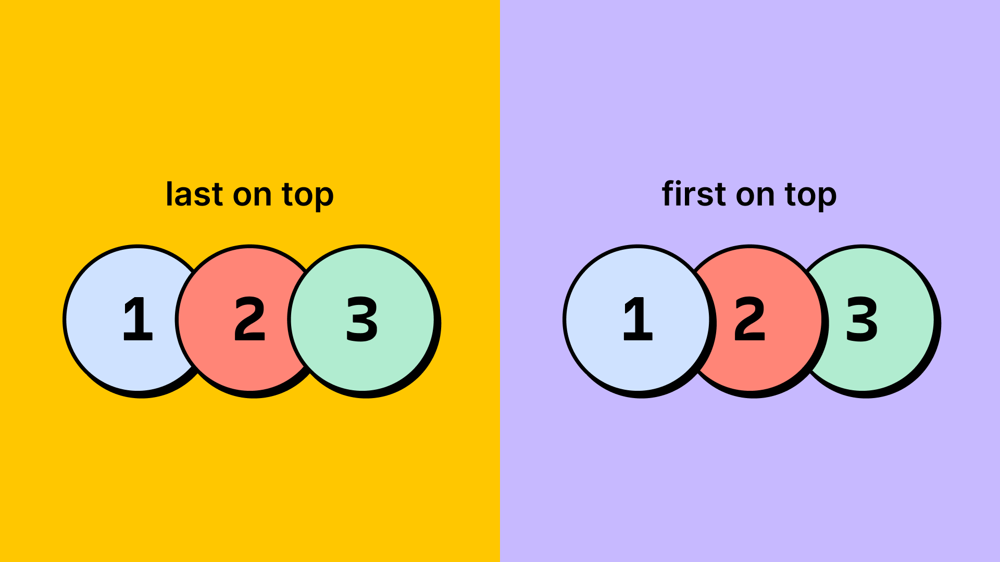
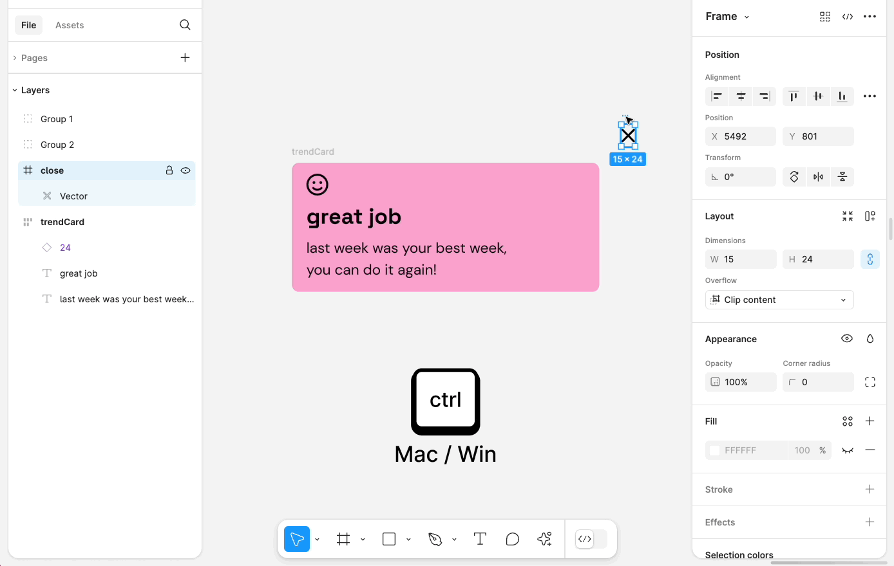
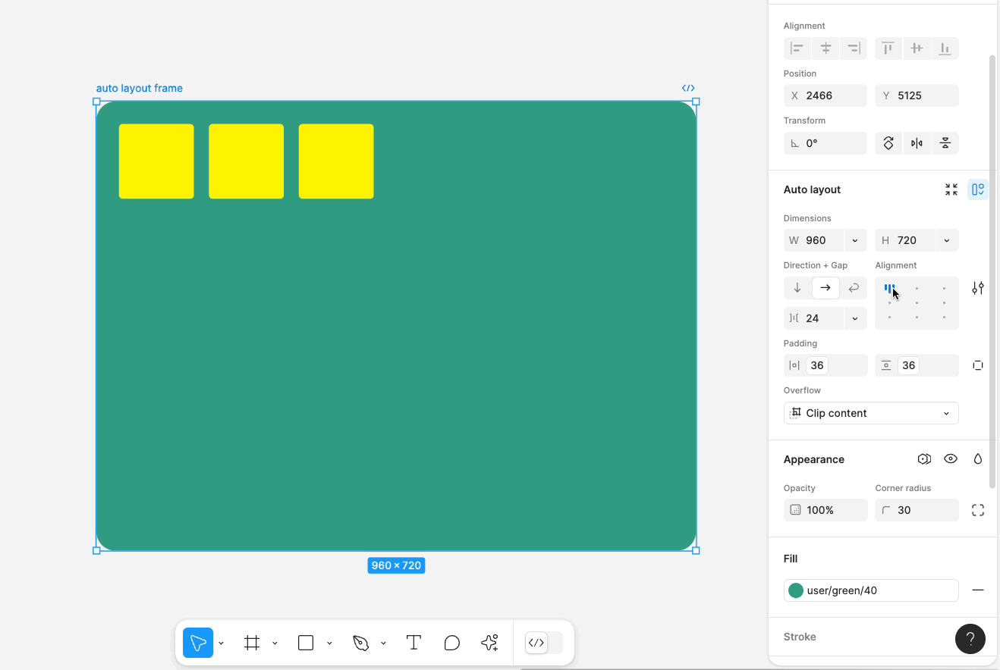
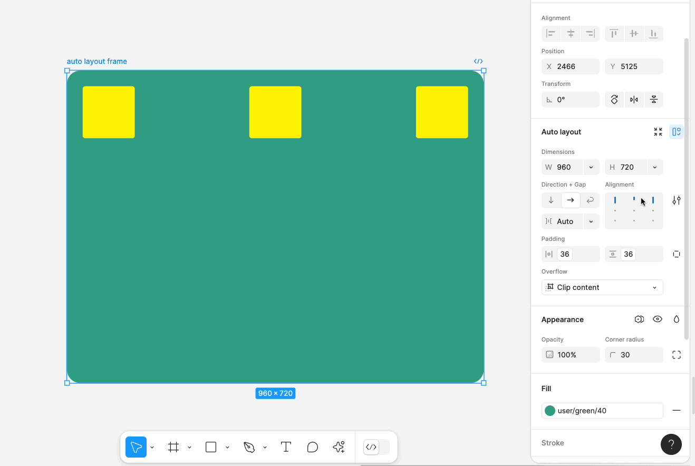
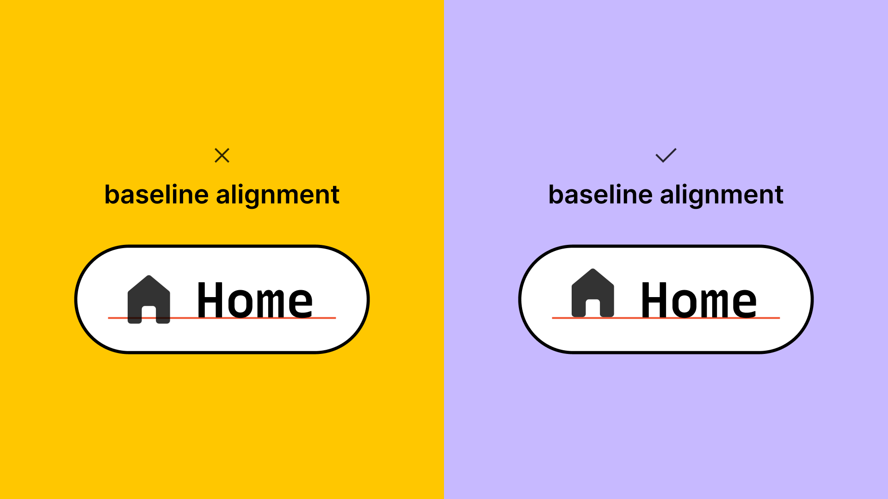

# Autolayout avec Figma

Autolayout permet la création de designs dynamiques avec la gestion d'une disposition automatique des élements.

<iframe allowfullscreen="" frameborder="0" height="368" src="https://www.youtube.com/embed/floQKLsWAy4" width="100%"></iframe>

La mise en page automatique (Autolayout) est une propriété que vous pouvez ajouter aux cadres et aux composants. Elle vous permet de créer des modèles qui s'agrandissent ou se rétrécissent pour s'adapter, et qui s'adaptent à la modification de leur contenu. Cette propriété est très utile lorsque vous devez ajouter de nouveaux calques, insérer des chaînes de texte plus longues ou maintenir l'alignement au fur et à mesure de l'évolution de vos dessins.

Il existe de nombreuses façons d'utiliser l'Autolayout :

- Créez des boutons qui s'agrandissent ou se rétrécissent au fur et à mesure que vous modifiez l'étiquette du texte.
- Créez des listes qui s'adaptent lorsque des éléments sont ajoutés, supprimés ou masqués.
- Combinez des cadres de mise en page automatique pour créer des interfaces complètes.

La mise en page automatique est une fonctionnalité puissante qui comporte de nombreux éléments mobiles et de nombreuses utilisations. Dans cet article, nous verrons comment fonctionnent les différents aspects de la mise en page automatique.

Les cadres avec mise en page automatique ont des propriétés différentes de celles des cadres ordinaires. Lorsque vous appliquez la mise en page automatique, vous constatez des changements dans le panneau de droite.

Vous ne pouvez pas effectuer les opérations suivantes sur les cadres avec mise en page automatique :

- 🚫 Ajouter des **grilles de mise en page** à ce cadre
- 🚫 Appliquer des **contraintes** à tout objet situé dans un cadre de disposition automatique, à moins que l'objet n'ait activé l'option Ignorer la disposition automatique.
- 🚫 Utiliser **la sélection intelligente** sur tous les objets à l'intérieur du cadre

## Flux de mise en page

### Direction

La direction décrit la façon dont le cadre de mise en page automatique se déroulera.

- **Vertical** : Ajouter, supprimer et réorganiser des objets le long de l'axe des ordonnées. Par exemple : des objets dans une liste, ou des messages dans un fil d'actualité ou une ligne de temps.
- **Horizontal** : Permet d'ajouter, de supprimer et de réorganiser des objets le long de l'axe des x. Par exemple : une rangée de boutons ou d'icônes dans un menu de navigation mobile.
- **Wrap** : Disposer des objets sur plusieurs lignes et colonnes dans un cadre. Les objets sont disposés horizontalement et s'étendent jusqu'à la ligne suivante. Par exemple : des galeries de photos ou un ensemble d'étiquettes.

### Ordre d'empilement des canevas

Lorsque plusieurs calques ont un espacement négatif pour créer une pile, le dernier objet (le plus à droite ou le plus en bas) de la pile est placé au-dessus par défaut.

Vous pouvez modifier l'ordre visuel de la pile tel qu'il apparaît sur le canevas.

Lorsque le cadre de mise en page automatique est sélectionné, cliquez sur le panneau de droite pour ouvrir les paramètres de mise en page automatique. En regard de **empilement de la toile**, sélectionnez :

- **Premier sur le dessus** : le premier calque de la pile sera sur le dessus.
- **Last on top:** le dernier calque de la pile sera au sommet.

> Remarque : lorsque l'ordre d'empilement est modifié, l'ordre des calques dans le panneau des calques reste le même. L'empilement dans le canevas est uniquement un changement visuel qui se produit dans le canevas.

### Ignorer la mise en page automatique

> Remarque : la fonction Ignorer la mise en page automatique était auparavant connue sous le nom de position absolue. La fonctionnalité a un nouveau nom, mais elle fonctionne toujours de la même manière.

Un objet pour lequel l'option **Ignore auto layout** est activée est exclu d'un flux de mise en page automatique tout en restant dans le cadre de mise en page automatique. L'objet et ses frères et sœurs environnants s'ignorent mutuellement, même s'ils se redimensionnent et se déplacent.

À l'instar de la position absolue en CSS, un objet qui ignore la mise en page automatique peut être placé exactement où vous le souhaitez par rapport à son conteneur parent.

Les objets dont l'option Ignorer la mise en page automatique est activée sont traités comme des objets dans un cadre normal. Cela signifie que vous pouvez appliquer des [contraintes](https://help.figma.com/hc/en-us/articles/360039957934) pour déterminer comment ils réagissent lorsque le cadre parent de la mise en page automatique est redimensionné. Les autres paramètres de mise en page automatique, tels que les options de redimensionnement et de mise en page, ne sont pas disponibles pour ces objets.

Vous pouvez faire en sorte qu'un objet ignore le flux de mise en page automatique en procédant de l'une des manières suivantes :

- Sélectionnez un enfant d'un cadre de mise en page automatique et cliquez dans le panneau de droite.
- Faites glisser un objet dans un cadre de mise en page automatique tout en appuyant sur ⌃ Control .

## Espacement

### Espace entre les éléments

Utilisez **écart entre les éléments** pour définir la distance, ou la répartition, entre les objets dans un cadre de mise en page automatique.

L'espacement entre les objets peut être réglé de deux manières différentes :

- **Auto** : L'espace entre les objets est réglé sur la plus grande distance possible. Tapez "Auto" dans le champ ou sélectionnez-le dans le menu déroulant.
- **Écart spécifié:** Spécifiez la distance qui doit séparer les objets. Saisissez une valeur dans le champ, modifiez les valeurs à l'aide des touches fléchées ou balayez le champ à l'aide du curseur.

Pour basculer rapidement entre ces deux paramètres, cliquez sur la case d'alignement et appuyez sur X.

Si la direction du cadre de mise en page automatique est définie sur vertical ou horizontal, vous pourrez définir l'espace entre les éléments verticalement ou horizontalement, respectivement. Si la direction du cadre est définie sur "wrap", vous pourrez définir l'espacement horizontal et vertical entre les éléments.

Astuce ! Maintenez la touche ⇧ Shift enfoncée tout en faisant glisser les poignées pour augmenter et réduire les valeurs à l'aide de votre [grand coup de pouce](https://help.figma.com/hc/en-us/articles/4404575206295).

### Rembourrage

Le remplissage contrôle l'espace vide ou blanc entre les limites d'un cadre de mise en page automatique et les objets enfants du cadre. Vous pouvez définir le remplissage uniformément, verticalement et horizontalement, ou avoir des valeurs différentes pour le remplissage en haut, à droite, en bas et à gauche.

Ajustez le remplissage à l'aide des commandes du canevas ou des champs d'espacement du panneau de droite.

Pour accéder aux commandes du canevas, sélectionnez un cadre de mise en page automatique et survolez-le. Des poignées roses apparaissent, semblables à celles de la sélection intelligente.

- Cliquez sur les poignées pour ouvrir les champs de saisie et entrer une valeur numérique
- Vous pouvez également cliquer sur la poignée et la faire glisser pour modifier l'espacement.

Les contrôles de remplissage dans le panneau de droite sont séparés en remplissage vertical (haut et bas) et horizontal (gauche et droite) par défaut.

- Pour définir un remplissage individuel, cliquez sur pour utiliser les champs de remplissage du haut, de la droite, du bas et de la gauche.
- Pour définir un remplissage uniforme ou pour utiliser une abréviation CSS, maintenez la touche ⌘ Commande ou Contrôle enfoncée et cliquez dans n'importe quel champ de remplissage. Vous pouvez également saisir une abréviation CSS. Par exemple, en entrant `1,2,3,4`, vous définissez le haut, la droite, le bas et la gauche à 1, 2, 3 et 4 respectivement. En entrant `1,2`, les valeurs de haut/bas sont fixées à 1 et celles de gauche/droite à 2 : 1 et gauche/droite : 2.

](https://help.figma.com/hc/article_attachments/5979592571159)

Astuce ! Appuyez sur la touche de tabulation pour passer d'un champ de saisie à l'autre.

### Coups de crayon dans la mise en page

Par défaut, les traits ne sont pas pris en compte dans le calcul de la taille des objets et n'affectent donc pas leur cadre parent ou leurs frères et sœurs environnants.

Cela peut ne pas être idéal lors du transfert des développeurs, car cela ne représente pas exactement la manière dont CSS rend les bordures.

Choisissez si les traits prendront de la place dans un cadre de mise en page automatique en allant dans les paramètres de mise en page automatique et en utilisant le menu déroulant à côté de **trait** pour sélectionner **inclus dans la mise en page** ou **exclu de la mise en page**.

## Alignement

### Définir l'alignement des objets enfants

Choisissez comment aligner les objets enfants dans un cadre de mise en page automatique. La direction du cadre de mise en page automatique et la distribution, ou l'espace entre les éléments, déterminent les options d'alignement disponibles.

Contrairement aux objets d'un cadre normal, vous ne pouvez pas contrôler l'alignement des objets individuellement. C'est pourquoi vous devez définir l'alignement des objets enfants sur le cadre de mise en page automatique parent.

Utilisez la case d'alignement dans le panneau de droite pour choisir parmi neuf options de mise en page pour les objets enfants d'un cadre.

- Sélectionnez la case et utilisez les touches fléchées pour passer d'un paramètre d'alignement à l'autre.
- Sélectionnez la case et appuyez sur W/A/S/D pour définir l'alignement sur le bord du cadre.

Si l'écart entre les éléments est réglé sur **Auto**, vous avez trois options pour chaque direction :

- Disposition verticale automatique : Gauche, Centre, Droite
- Disposition automatique horizontale : Haut, Centre, Bas

Si l'écart entre les éléments est défini à un nombre spécifique, vous disposez des neuf mêmes options pour chaque direction :

- En haut à gauche
- En haut au centre
- En haut à droite
- Gauche
- Au centre
- Droite
- Bas gauche
- Centre du bas
- Bas droit

> Remarque : lorsqu'une ou plusieurs propriétés de redimensionnement sont définies sur "hug contents", certaines sélections ne donneront pas lieu à des mises en page visuellement différentes sur le canevas. En effet, l'option "hug contents" supprime tout espace supplémentaire autour des objets enfants.

### Alignement de la ligne de base du texte

La ligne de base est la ligne invisible sur laquelle repose un texte ou un calque. En typographie, les jambages descendants s'étendent sous cette ligne.

Dans certains cas, l'alignement des lignes de base des calques peut créer un meilleur équilibre, par exemple lorsque l'on aligne les lignes de base de calques de texte ayant des tailles de police différentes, ou lorsque l'on aligne une icône sur un calque de texte.

Pour aligner les calques en fonction de leurs lignes de base, sélectionnez les calques que vous souhaitez aligner et cliquez sur le panneau de droite pour ouvrir les paramètres de mise en page automatique. En regard de l'alignement de la ligne de base du texte, cliquez sur pour activer l'alignement de la ligne de base.

Astuce ! Cliquez sur la case d'alignement dans le panneau de droite et appuyez sur B pour activer ou désactiver l'alignement de la ligne de base du texte.

## Redimensionnement

L'une des fonctions les plus puissantes de la mise en page automatique est sa capacité à contrôler les dimensions des objets dans un cadre de mise en page automatique.

Vous pouvez définir le comportement de redimensionnement des cadres de mise en page automatique parents afin qu'ils s'adaptent à toute modification apportée aux objets enfants. Les paramètres de redimensionnement peuvent être appliqués aux objets sur les axes X et Y individuellement à l'aide des menus déroulants du panneau de droite.

Lorsque vous survolez une option de redimensionnement dans le menu déroulant, des lignes apparaissent sur le canevas pour indiquer comment le cadre de la conception sera redimensionné et modifié.

Un calque à l'intérieur d'un cadre mobile est sélectionné. Une boîte met en évidence la section de redimensionnement du panneau de droite](links/autolayout/24357051175447.png)

> Remarque : les couches de texte ont également leurs propres propriétés de redimensionnement. Dans un cadre de mise en page automatique, cela peut produire des résultats utiles.

Si vous souhaitez que vos cadres de mise en page automatique soient totalement fluides, nous vous déconseillons d'utiliser des zones de texte de taille fixe. Les calques de texte de taille fixe ne se redimensionneront pas pour s'adapter à votre texte, ce qui peut entraîner un chevauchement entre les calques dans un cadre de mise en page automatique.

[En savoir plus sur le redimensionnement du texte →](https://help.figma.com/hc/en-us/articles/360039956634)

### Largeur ou hauteur fixe

Lorsqu'un cadre de mise en page automatique est défini sur une largeur ou une hauteur **fixe**, les valeurs des dimensions du cadre restent les mêmes, quel que soit le contenu qu'il contient. La taille du cadre ne réagit pas aux modifications des objets qu'il contient, comme une chaîne de texte dont la longueur change.

### Dimensions minimales et maximales

Vous pouvez définir une largeur et une hauteur minimales ou maximales pour tout cadre de mise en page automatique et ses enfants.

- Ouvrez le menu déroulant **Largeur** pour trouver **Ajouter la largeur minimale** et **Ajouter la largeur maximale**.
- Ouvrez le menu déroulant **Hauteur** pour trouver **Ajouter la hauteur min** et **Ajouter la hauteur max**.

Sélectionnez une option dans le menu déroulant Largeur ou Hauteur. Dans le nouveau champ qui apparaît, saisissez une valeur ou utilisez le menu déroulant pour appliquer une variable numérique.

Si un objet contient un paramètre min ou max, son icône de largeur ou de hauteur gagnera deux lignes, une de chaque côté. Vous pouvez survoler ces icônes pour prévisualiser les limites des dimensions sur le canevas.

Lorsque vous désélectionnez et resélectionnez un objet, ses champs de dimensions min et max sont masqués dans le panneau de droite. Pour y accéder à nouveau, cliquez sur l'icône de largeur ou de hauteur.

Pour supprimer un paramètre min ou max, ouvrez le menu déroulant **Largeur** ou **Hauteur** et choisissez **Supprimer min et max**.

> Remarque : les calques ne peuvent pas avoir à la fois une **hauteur maximale** et un nombre défini de **lignes maximales**. L'ajout d'une hauteur maximale définit les lignes maximales sur Auto. La définition d'un nombre de lignes maximales supprimera le paramètre de hauteur maximale du calque. [En savoir plus sur les lignes maximales →](https://help.figma.com/hc/en-us/articles/360039956634#truncate)

### Contenu des câlins

Définissez un cadre de mise en page automatique sur **Hug content** pour qu'il se redimensionne en fonction de ses objets enfants. Le cadre conservera les dimensions les plus petites possibles pour entourer les objets qu'il contient, tout en respectant la valeur de remplissage.

> Astuce ! Double-cliquez sur le bord vertical ou horizontal de la boîte de délimitation d'un objet de mise en page automatique pour lui attribuer le statut **Contenu d'étreinte**.

> Remarque : si des objets enfants d'un cadre de mise en page automatique sont définis sur **remplir le conteneur**, le cadre parent n'étreint plus le contenu et devient **fixe** pour l'axe.

### Remplir le conteneur

Les objets d'un cadre de mise en page automatique dont l'option **remplir le conteneur** est activée s'étirent à la largeur et/ou à la hauteur de leur cadre parent.

Les objets enfants d'un cadre de présentation automatique seront également définis comme **remplir le conteneur** s'ils sont redimensionnés manuellement à la largeur totale du cadre parent.

Astuce ! Maintenez la touche ⌥ Option ou Alt enfoncée et double-cliquez sur le bord vertical ou horizontal du cadre de délimitation d'un objet de mise en page automatique pour le définir sur **remplir le conteneur**.

### Note sur les contraintes

Vous ne pouvez pas appliquer de contraintes aux objets enfants dans un cadre de disposition automatique, sauf si l'objet [ignore le flux de disposition automatique](https://help.figma.com/hc/en-us/articles/360040451373-Explore-auto-layout-properties#h_01G2RPRBBKVKXK0JV59NCSKEE0). En revanche, vous pouvez utiliser la propriété de redimensionnement pour définir la manière dont les objets réagissent au redimensionnement du cadre ou des objets qu'il contient.

Vous pouvez toujours appliquer des contraintes au cadre de mise en page automatique lui-même s'il est imbriqué dans un cadre normal. La section **Contraintes** et les options de redimensionnement s'affichent, vous permettant de définir à la fois les contraintes du cadre de mise en page automatique et le comportement de redimensionnement de tous les objets qu'il contient.

Par exemple, si vous avez créé un ensemble de balises à l'aide de l'option Si vous avez créé un ensemble de balises à l'aide de la mise en page automatique, vous souhaiterez peut-être qu'il s'adapte à différentes tailles d'écran. Vous pouvez utiliser les contraintes pour vous assurer que la barre de navigation réagit correctement lorsque son cadre parent est redimensionné, et le redimensionnement pour contrôler la manière dont les objets de la barre de navigation réagissent à ces changements.

[En savoir plus sur les contraintes →](https://help.figma.com/hc/en-us/articles/360039957734)

<iframe allowfullscreen="" frameborder="0" height="368" src="https://www.youtube.com/embed/videoseries?list=PLXDU_eVOJTx55HFubfbTL3ellJjBM2QE2" width="100%"></iframe>