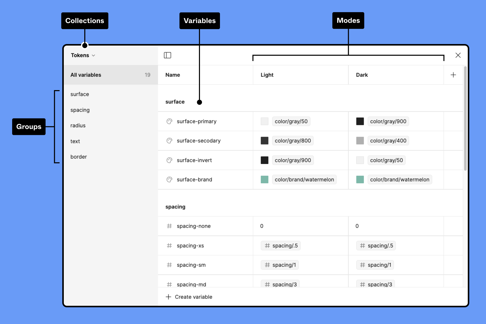
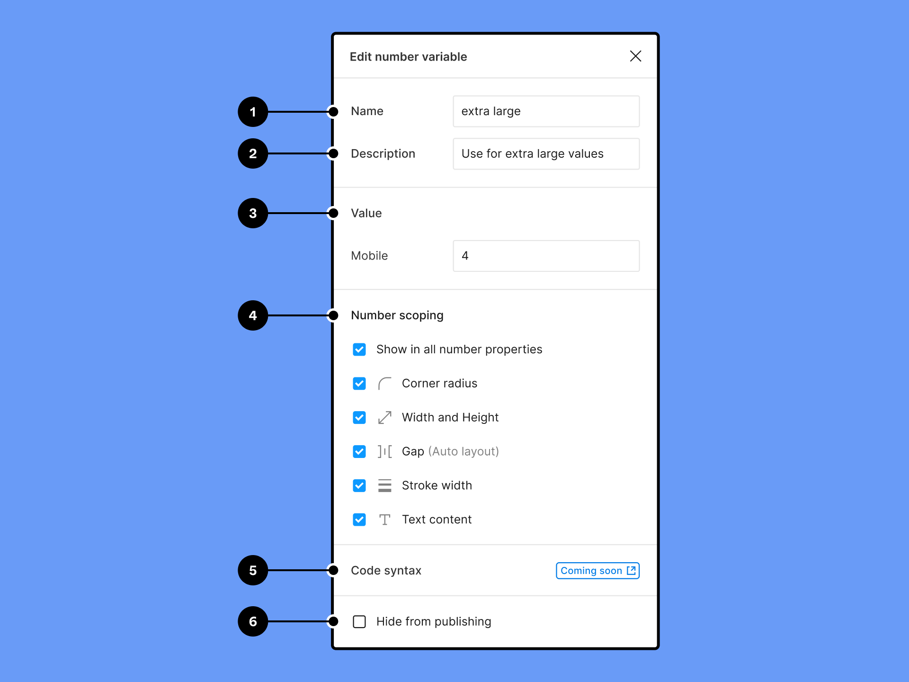

# Créer et gérer des variables

## Accéder à la fenêtre modale Variables

Utilisez la fenêtre modale **Variables** pour créer et gérer des variables, modes, groupes et collections.

1. Deselectionnez tout sur le canevas en appuyant sur Échap ou en cliquant sur le canevas.
2. À partir de la barre latérale droite, cherchez la section **Local variables**.
3. Cliquez sur **Open variables.**

## Créer une variable

1. À partir de n'importe quelle collection, cliquez sur **\+ Create variable**.
2. Sélectionnez un [type de variable](https://help.figma.com/hc/en-us/articles/14506821864087/) dans le menu déroulant.
3. Donnez un nom à la variable dans la première colonne et une valeur dans la deuxième colonne.

Pour dupliquer une variable, sélectionnez une ou plusieurs variables et appuyez sur ⇧ Maj Entrée.

Pour supprimer une variable, cliquez sur celle-ci avec le bouton droit de la souris et sélectionnez **Delete variable**.

Astuce : Une variable peut stocker plusieurs valeurs, pour des designs plus dynamiques. [Découvrez comment utiliser la création de modes multiples pour les variables →](https://help.figma.com/hc/en-us/articles/15343816063383)

### Créer un alias

Créer un alias pour une variable afin de lier sa valeur à une variable existante. Cela vous permet de mettre en œuvre des jetons de design et de gérer plus efficacement les mises à jour de vos designs.

Par exemple, supposons que vous ayez plusieurs variables de couleur faisant référence à la même variable de couleur. Si celle-ci doit être mise à jour, il suffira de mettre à jour la source au lieu de mettre à jour manuellement chaque instance de la couleur.

Une variable peut faire référence à d'autres variables du même type.

Pour créer un alias pour une variable :

1. À partir de la fenêtre modale **Variables**, cliquez avec le bouton droit de la souris sur la valeur de la variable et sélectionnez **Create alias**.
2. À partir de l'onglet **Libraries**, choisissez une variable pour définir un alias. Vous pouvez utiliser la barre de recherche pour trouver une variable par son nom ou parcourir les bibliothèques activées.

Pour détacher un alias, survolez le champ de valeur et cliquez sur **Detach alias.**

## Éditer une variable

Survolez la rangée d'une variable et cliquez sur l'icône **Edit variable** pour ouvrir sa fenêtre modale d'édition.

À partir de là, vous pouvez :

1. Changer le nom de la variable
2. Ajouter une description pour expliquer comment utiliser une variable
3. Modifier la valeur de la variable
4. Utiliser les cases à cocher pour choisir les propriétés auxquelles la variable peut s'appliquer
5. Ajouter de la syntaxe de code
6. [Masquer la variable de la publication →](https://help.figma.com/hc/en-us/articles/360039238193)

### Afficher une variable dans des propriétés spécifiques

Par défaut, les variables peuvent être appliquées à toutes les propriétés de design prises en charge.

Vous pouvez délimiter les variables de nombre en limitant les propriétés auxquelles elles peuvent s'appliquer.

À partir de la fenêtre modale **edit variable**, activez ou désactivez les propriétés du design où vous souhaitez que la variable soit disponible.

La prise en charge complète des variables de couleur sera bientôt disponible. Actuellement, vous pouvez effectuer vos sélections en fonction des variables de couleur. Toutefois, ces limitations ne seront pas appliquées. Cela signifie que vous pouvez toujours utiliser les variables de couleur pour toutes les propriétés prises en charge, même si vous avez choisi de les limiter.

### Syntaxe de code (à venir)

La syntaxe du code vous permettra de représenter les variables dans le code à l'aide de noms de variables valides. Vous pourrez créer des noms différents pour chaque plateforme, y compris CSS, JS, Kotlin et Swift.

La syntaxe du code d'une variable apparaîtra dans les extraits de code du [Dev Mode](https://help.figma.com/hc/en-us/articles/15023124644247) lors de l'inspection des éléments utilisant la variable.

Remarque : la syntaxe de code n'est pas encore disponible mais le sera bientôt.

## Regrouper une sélection de variables

Pour organiser des variables dans un groupe :

1. À partir de la fenêtre modale **Variables**, sélectionnez plusieurs variables :
    - Maintenez ⌘ Command / Control enfoncé pour sélectionner plusieurs variables
    - Maintenez ⇧ Shift enfoncé pour sélectionner une plage de variables
2. Cliquez sur la selection avec le bouton droit de la souris et sélectionnez **New group with selection**.

Cliquez sur les groupes et faites-les glisser dans la barre latérale de la fenêtre modale Variables afin de réorganiser les groupes. Vous pouvez également cliquer sur les groupes et les faire glisser sur d'autres groupes pour les imbriquer.

### Renommer un groupe

1. À partir de la fenêtre modale **Variables**, cliquez sur **Toggle sidebar** afin qu'elle soit visible.
2. Double-cliquez sur le nom du groupe
3. Saisissez un nouveau nom pour le groupe de variables.

### Gérer un groupe

1. À partir de la fenêtre modale **Variables**, cliquez sur **Toggle sidebar** afin de la rendre visible.
2. Cliquez avec le bouton droit de la souris sur le nom du groupe dans la barre latérale.
3. Dans le menu, choisissez l'une des options suivantes :
    - **Ungroup**
    - **Duplicate group**
    - **Delete group**

## Créer et gérer des collections de variables

Pour créer une collection de variables :

1. À partir de la fenêtre modale **Variables**, cliquez sur **Toggle sidebar** afin de la rendre visible.
2. Ouvrez la liste déroulante des collections et sélectionnez **Create collection.**

Pour renommer ou supprimer une collection de variables :

1. À partir de la fenêtre modale **Variables**, cliquez sur **Toggle sidebar** pour la rendre visible.
2. Ouvrez la liste déroulante des collections et choisissez la collection que vous souhaitez gérer.
3. Ouvrez à nouveau la liste déroulante des collections et sélectionnez **Rename collection** ou **Delete collection**.

Prêt à poursuivre votre découverte des variables ? Consultez les sujets suivants :

- [Publier des variables dans les bibliothèques de l'équipe →](https://help.figma.com/hc/en-us/articles/360025508373-Publish-styles-and-components)
- [Appliquer des variables aux designs →](https://help.figma.com/hc/en-us/articles/15343107263511)
- [Créer des modes pour les variables →](https://help.figma.com/hc/en-us/articles/15343816063383)
- [Utiliser des variables pour les prototypes avancés →](https://help.figma.com/hc/en-us/articles/14506587589399)
