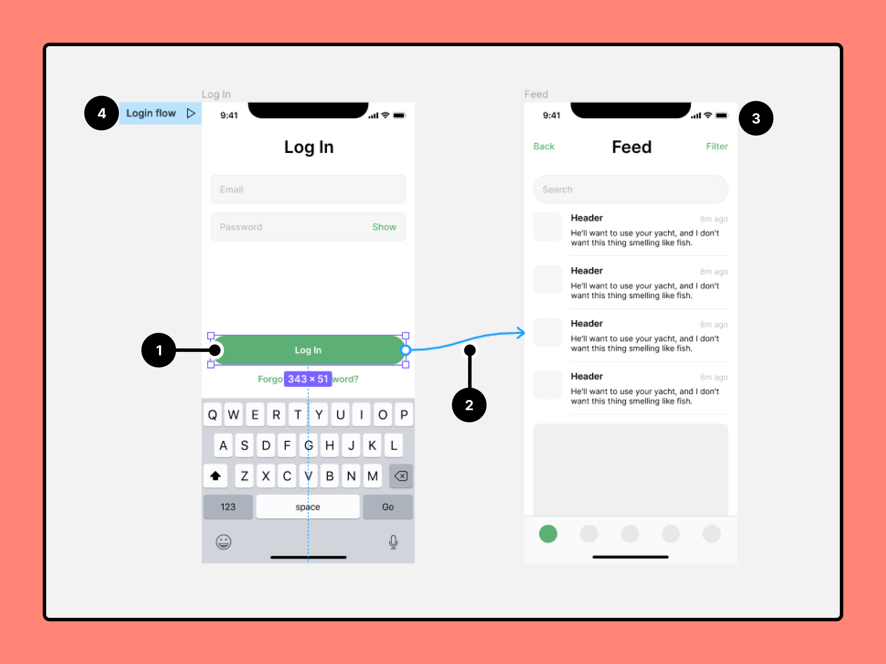
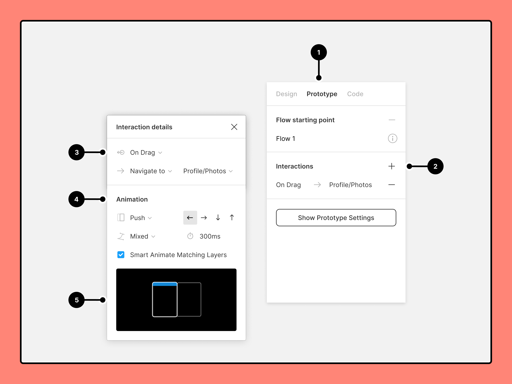
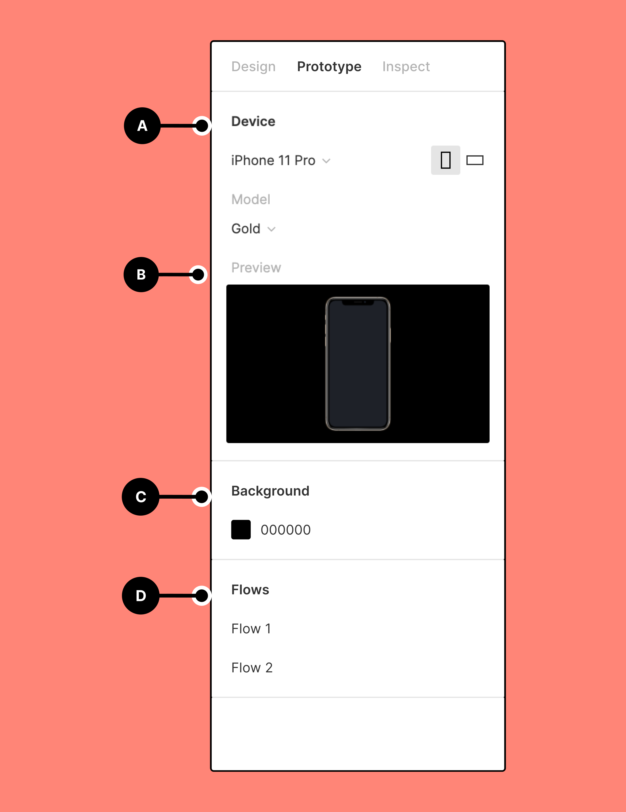

# Prototypage dans Figma

Les fonctionnalités de prototypage de Figma vous permettent de créer des flux interactifs qui explorent la façon dont un utilisateur peut interagir avec vos designs.

Les prototypes sont un excellent moyen :

- d'obtenir un aperçu des interactions et des flux utilisateur,
- de partager et itérer des idées,
- d'obtenir les commentaires des collaborateurs,
- de tester les interactions avec les utilisateurs,
- de présenter vos designs aux parties prenantes.

Regardez notre vidéo sur le prototypage ci-dessous. Vous pouvez également consulter notre [Playlist concernant la collaboration et le prototypage](https://www.youtube.com/playlist?list=PLXDU_eVOJTx7aqRW3Skp1aRT9ktC3ctqA) sur Youtube.

**Astuce !** Pour un flux de travail encore plus efficace, vous pouvez basculer rapidement entre les onglets **Design** et **Prototype**  à l'aide du raccourci clavier Maj E.

## Flux et points de départ

Avec le prototypage dans Figma, vous pouvez créer plusieurs flux pour votre prototype sur une seule page pour prévisualiser l'ensemble du parcours et de l'expérience d'un utilisateur dans vos designs.

Un flux est constitué du réseau de cadres et de connexions sur une seule page. Un prototype peut tracer l'ensemble du parcours d'un utilisateur dans votre application ou votre site Web, ou se concentrer sur un segment spécifique de celui-ci via son propre flux. Par exemple : votre prototype couvre toutes les interactions possibles sur un site de e-commerce. Dans le prototype, vous disposez de flux pour créer un compte, ajouter des articles à un panier et régler.

Figma crée un point de départ de flux lorsque vous ajoutez votre première connexion entre deux cadres. Il existe d'autres façons d'ajouter un point de départ de flux à votre prototype :

- En ayant sélectionné le cadre de départ, cliquez sur la section dans le **Point de départ du flux** de la barre latérale droite.
- Cliquez avec le bouton droit de la souris sur le cadre, puis cliquez sur **Ajouter un point de départ**.
- Dupliquer un cadre avec un point de départ existant.

Lorsqu'il est temps de tester vos designs, vous pouvez partager l'intégralité du prototype ou [copier le lien vers un point de départ du flux](https://help.figma.com/hc/en-us/articles/360039823894).

**[Pour en savoir plus sur les points de départ et les flux →](https://help.figma.com/hc/en-us/articles/360039823894)**

Remarque : Un cadre de premier niveau peut faire partie de plusieurs flux, mais ne peut avoir qu'un seul point de départ. Les cadres imbriqués dans un cadre de départ de premier niveau peuvent avoir des connexions qui permettent à l'utilisateur de naviguer dans plusieurs flux. Par exemple, les boutons Se connecter et S'inscrire peuvent être imbriqués dans le même cadre de point de départ, puis être connectés à des cadres dans des flux distincts pour chaque expérience.

## Créer des connexions

1. Sélectionnez la zone interactive pour la connexion.
2. Cliquez sur pour créer la connexion.
3. Faites-le glisser vers la destination.
4. S'il n'y a pas de connexions existantes, Figma fera du premier cadre un point de départ.

Astuce ! Vous pouvez créer des connexions à partir de plusieurs objets vers le même cadre de destination en même temps, ce qui vous permet d'économiser du temps et de l'énergie lors de l'élaboration de vos flux de prototypes. Pour ce faire, sélectionnez plusieurs zones interactives de départ sur votre canevas, puis cliquez sur l'icône et faites-la glisser vers la destination.

**[En savoir plus sur la création et la modification des connexions groupées →](https://help.figma.com/hc/en-us/articles/360040315773-Prototype-interactions-and-animations)**

## Créez des interactions et des animations

1. Ouvrez l'onglet **Prototype** dans la barre latérale située à droite
2. Ajoutez des **interactions**
3. Définissez les détails de l'interaction
4. Appliquez une **animation**
5. Visualisez **l'Aperçu** de votre animation

## Régler les paramètres du prototype

1. Sélectionnez un **Appareil** et un **Modèle**
2. Visualisez **l'Aperçu** de votre prototype
3. Sélectionnez la couleur de **l'Arrière-plan**
4. Définissez le **cadre de départ** du prototype

## En savoir plus sur le prototypage

### Lancez-vous

- [Créez les interactions et l'animation du prototypes](https://help.figma.com/hc/en-us/articles/360040315773)
- [Sélectionnez un point de départ pour votre prototype](https://help.figma.com/hc/en-us/articles/360039823894)
- [Personnalisez votre appareil de prototype](https://help.figma.com/hc/en-us/articles/360039823894)
- [Actions](https://help.figma.com/hc/en-us/articles/360040035874), [déclencheurs](https://help.figma.com/hc/en-us/articles/360040035834) et [animations](https://help.figma.com/hc/en-us/articles/360040522373) du prototype

### Interactions avancées

- [Créer des superpositions dans vos prototypes](https://help.figma.com/hc/en-us/articles/360039818254)
- [Créez des animations avancées avec l'Animation automatique](https://help.figma.com/hc/en-us/articles/360039818874)
- [Interactions de défilement du prototype avec options de défilement](https://help.figma.com/hc/en-us/articles/360039818734)
- [Ajouter une vidéo à des prototypes](https://help.figma.com/hc/en-us/articles/8878274530455)
- [Ajouter des GIF animés à des prototypes](https://help.figma.com/hc/en-us/articles/360041486873)

### Partager et collaborer

- [Afficher les connexions de prototype](https://help.figma.com/hc/en-us/articles/4411431245335)
- [Définir les options du mode présentation du prototype](https://help.figma.com/hc/en-us/articles/360040318013)
- [Partager votre prototype](https://help.figma.com/hc/en-us/articles/360039822654)
- [Afficher les prototypes sur un appareil mobile](https://help.figma.com/hc/en-us/articles/360040321093-View-prototypes-on-a-mobile-device)
- [Faire des commentaires sur des prototypes](https://help.figma.com/hc/en-us/articles/360039824594)

## Glossaire

- Une **zone interactive** est l'endroit où l'interaction a lieu. Elle peut être n'importe quel objet dans le cadre d'origine, par exemple un lien, un bouton, une image ou une icône, etc
- Les **Connexions** sont les flèches bleues ou « nouilles » qui relient la zone interactive à la destination. Nous appliquons les paramètres d'interaction et d'animation via la connexion.
- Un **flux** est le réseau de cadres connectés qui forment un chemin à travers un prototype. Chaque flux possède son propre **point de départ**. Plusieurs flux peuvent exister dans un prototype.
- Le **point de départ** est le premier cadre d'un flux. Définissez plusieurs points de départ pour afficher différents flux du prototype dans le mode présentation.
- Le **déclencheur** détermine le type d'interaction avec la zone interactive susceptible de faire progresser le prototype. Il peut s'agir d'une interaction avec la souris ou une interaction tactile, par exemple un tapotement, un glisser-déplacer, un clic, un survol, etc.
- La **destination** est l'endroit où la transition se termine. Il doit s'agir d'un cadre de premier niveau, un cadre qui est ajouté directement au canevas, et non d'un objet dans un cadre. Si nous pensons passer de A à B, **A** est la zone interactive et **B** est la destination.
- L'**action** définit le type de progression du prototype. Par exemple, l'action peut être de naviguer vers un autre cadre ou d'ouvrir une URL externe.
- Les paramètres d'**animation** déterminent la façon dont le prototype se déplace d'un cadre à l'autre. Vous pouvez contrôler le type d'animation, ainsi que la vitesse et la direction.
- Une **transition** est le type d'animation. Cette option définit la manière dont l'action se déplace vers la destination.
- La **direction** contrôle la direction d'origine de la transition. Choisissez entre gauche, droite, haut ou bas.
- La **durée** contrôle le temps nécessaire pour terminer l'animation. Plus la durée est courte, plus la transition est rapide. Sélectionnez une durée comprise entre 1 ms et 10 000 ms (10 secondes).
- L'**Atténuation** affecte l'accélération de l'animation, c'est-à-dire si elle démarre lentement ou rapidement. Cela vous permet de créer des animations plus naturelles.
- Les **Superpositions** sont des cadres qui apparaissent au-dessus de l'écran ou du cadre actuel. Vous pouvez utiliser des superpositions pour créer des infobulles, des menus interactifs, des alertes ou des confirmations.
- Les **Options de défilement** vous permettent de définir la façon dont votre prototype réagit au défilement. Cela vous permet de créer des interactions utilisateur plus avancées, par exemple des carrousels, des galeries ou des cartes interactives.
- Choisissez l'**appareil** qui s'affiche lors de la présentation de votre prototype. Définissez l'appareil et le modèle.
- La **couleur de l'arrière-plan** vous permet de définir la couleur à l'arrière-plan de votre prototype.
- Si vous disposez d'un prototype avec cadres portrait et paysage, vous pouvez sélectionner une **orientation**. L'orientation est définie pour l'ensemble du prototype. Il n'est pas possible de basculer entre les modes portrait et paysage dans un prototype.
- Un **aperçu** vous montrera l'aspect ou le fonctionnement du prototype. Nous vous proposons des aperçus des **animations** et des paramètres d'**appareil** du prototype.
