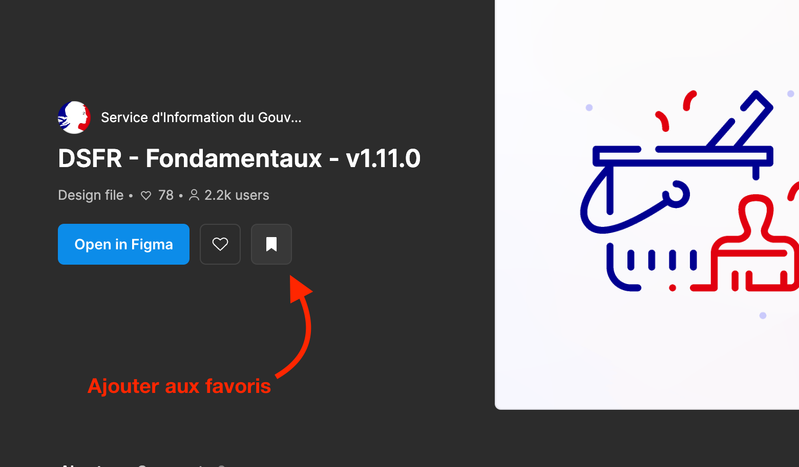
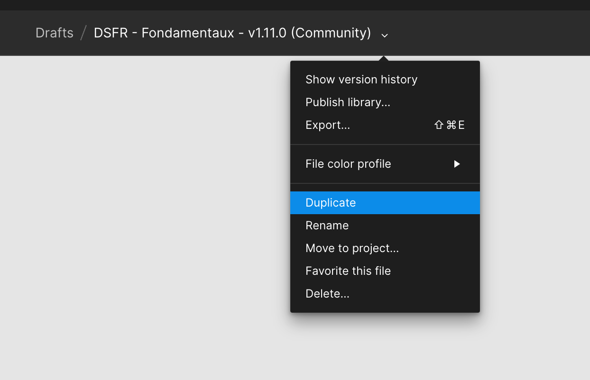

# Plugins et communauté

La partie communautaire de Figma offre un écosystème dynamique où les utilisateurs peuvent partager, découvrir et collaborer autour de ressources de conception.

## 1. Ressources partagées

Les utilisateurs peuvent partager une variété de ressources de conception, notamment :

- **Modèles de conception** : Modèles prêts à l'emploi pour différents types de projets, tels que des maquettes d'application, des designs web, des présentations, etc.
- **Composants et bibliothèques** : Composants réutilisables et bibliothèques de composants pour des éléments d'interface utilisateur courants tels que des boutons, des barres de navigation, des icônes, etc.
- **Plugins** : Extensions personnalisées pour étendre les fonctionnalités de Figma, telles que la génération de contenu, l'automatisation des tâches, etc.

> Exemple avec le DSFR:
[Les Fondamentaux](https://www.figma.com/community/file/1042832497184172837/dsfr-fondamentaux-v1-11-0)
[Les composants](https://www.figma.com/community/file/1042832984468443942/dsfr-composants-v1-11-0)
[Les Pictogrammes](https://www.figma.com/community/file/1098654384051611363/dsfr-pictogrammes-v1-11-0)

### Pour utiliser un fichier de la communauté

1. Explorer la page de recherche de la communauté à la recherche d'un design system ou d'une librairie ou de tout autre fichier que vous souhaitez utiliser
   

2. Marquez le fichier en favoris afin de l'ajouter à vos brouillons (Drafts)
   

3. Si nécessaire, installez les ressources manquantes (polices de caractères) et suivez les instructions du fichier pour utiliser les composants dans votre projet.

## 2. Exploration et découverte

Les utilisateurs peuvent explorer les ressources partagées par d'autres membres de la communauté en utilisant les fonctionnalités suivantes :

- **Recherche et filtrage** : Recherche par mots-clés, filtres par type de ressource, popularité, etc.
- **Catégories** : Navigation par catégories telles que la conception web, la conception mobile, l'UX/UI, les illustrations, etc.
- **Tendance** : Découverte des ressources populaires et tendances du moment.

## 3. Collaboration et feedback

Les utilisateurs peuvent collaborer et donner leur avis sur les ressources partagées en utilisant les fonctionnalités suivantes :

- **Commentaires** : Possibilité de laisser des commentaires et des retours d'expérience sur les ressources partagées.
- **Clonage et remixage** : Clonage des fichiers partagés pour les modifier et les adapter à leurs propres besoins, puis les repartager avec la communauté.
- **Suivi des mises à jour** : Suivi des mises à jour et des modifications apportées aux ressources partagées par leurs créateurs.

## 4. Apprentissage et partage de connaissances

La communauté Figma offre également des opportunités d'apprentissage et de partage de connaissances, notamment :

- **Articles et tutoriels** : Articles et tutoriels sur des sujets de conception, des techniques avancées, des bonnes pratiques, etc.
- **Ateliers et événements** : Ateliers en ligne, webinaires, meetups et autres événements communautaires organisés par Figma et par les membres de la communauté.

**La partie communautaire** de Figma est un espace vibrant où les designers peuvent trouver et partager une multitude de ressources de conception, collaborer avec d'autres membres de la communauté, apprendre de nouvelles techniques et découvrir les dernières tendances en matière de conception. C'est un élément essentiel de l'écosystème Figma qui enrichit l'expérience de conception et favorise le développement professionnel des designers.

**Les plugins** sont des outils qui viennent enrichir les fonctionnalités de base du logiciel, ils sont développés par des organismes tiers et par des développeurs indépendant de Figma. On peut les utiliser dans chaque projet après les avoir ajouté (bookmarké) dans notre compte, à l'aide du bouton des plugins.